# k1s0 ver0.1.1 改修方針書

## ステータス

提案（Proposed）

## 日付

2026-01-28

---

## 目次

1. [概要](#概要)
2. [背景・目的](#背景目的)
3. [現状分析](#現状分析)
4. [目標アーキテクチャ](#目標アーキテクチャ)
5. [詳細設計](#詳細設計)
6. [実装計画](#実装計画)
7. [影響範囲](#影響範囲)
8. [マイグレーション方針](#マイグレーション方針)
9. [テスト計画](#テスト計画)
10. [リスクと軽減策](#リスクと軽減策)

---

## 概要

k1s0 ver0.1.1 では、現行の2層構造（framework → feature）を3層構造（framework → domain → feature）に拡張し、組織的な開発体制に対応する。

### 主要変更点

| 項目             | 変更内容                                       |
| ---------------- | ---------------------------------------------- |
| ディレクトリ構造 | `domain/` レイヤーの新設                       |
| CLI コマンド     | `k1s0 new-domain` の追加、`new-feature` の拡張 |
| manifest.json    | `layer`, `domain` フィールドの追加             |
| Lint ルール      | K040-K042（層間依存チェック）の追加            |
| テンプレート     | domain 層用テンプレートの追加                  |

---

## 背景・目的

### 背景

現行の k1s0 は以下の2層構造を採用している:

```
framework/  →  feature/
(共通基盤)     (個別業務機能)
```

しかし、大規模組織での運用では以下の課題がある:

1. **責任境界の曖昧さ**: framework と feature の間に「業務ドメイン共通」という概念が欠落
2. **チーム分割の困難さ**: 複数の業務チームが共通で使う機能を feature に置くか framework に置くか判断が難しい
3. **依存関係の複雑化**: feature 間で共通機能を共有しようとすると、依存関係が複雑になる

### 目的

1. **3層構造の導入**: framework → domain → feature の明確な階層化
2. **チーム責任の明確化**: 各層を担当するチームを明確に分離
3. **依存関係の制御**: 層間の依存方向を強制し、設計の一貫性を維持

### 各層の役割定義

| 層 | 役割 | 内容 | 例（製造業） |
|----|------|------|-------------|
| **framework** | システム共通の動き | 業務内容に依存しない、システム全体で共通して使用する基盤機能 | 認証・認可、ログ出力、エラーハンドリング、DB接続、設定管理、ヘルスチェック |
| **domain** | 各業務部門の共通の動き | 特定の業務領域（ドメイン）内で複数の機能が共通して使用するビジネスロジック | 生産管理ドメイン：BOM（部品表）、工程マスタ、生産能力計算ロジック |
| **feature** | 特定業務でのみの処理 | 個別の業務機能に閉じた処理。他の機能からは参照されない | 製造指示発行、作業日報入力、検査成績書出力 |

```
┌─────────────────────────────────────────────────────────────────────────┐
│  framework（システム共通）                                               │
│  「どの業務でも必要な技術基盤」                                          │
│  - 認証/認可      - ログ/トレース    - DB接続                           │
│  - エラー処理     - 設定管理         - API基盤                          │
└───────────────────────────────┬─────────────────────────────────────────┘
                                │
                                ▼
┌─────────────────────────────────────────────────────────────────────────┐
│  domain（業務部門共通）                                                  │
│  「その業務領域なら必ず使うビジネスルール」                               │
│                                                                          │
│  ┌──────────────┐  ┌──────────────┐  ┌──────────────┐                   │
│  │ production   │  │ inventory    │  │ quality      │                   │
│  │ (生産管理)   │  │ (在庫管理)   │  │ (品質管理)   │                   │
│  │              │  │              │  │              │                   │
│  │ ・BOM(部品表)│  │ ・ロット管理 │  │ ・検査規格   │                   │
│  │ ・工程マスタ │  │ ・在庫計算   │  │ ・不良区分   │                   │
│  │ ・生産能力   │  │ ・倉庫/棚番  │  │ ・測定基準   │                   │
│  └──────────────┘  └──────────────┘  └──────────────┘                   │
│                                                                          │
│  ┌──────────────┐  ┌──────────────┐                                     │
│  │ procurement  │  │ maintenance  │                                     │
│  │ (購買/調達)  │  │ (設備保全)   │                                     │
│  │              │  │              │                                     │
│  │ ・仕入先管理 │  │ ・設備台帳   │                                     │
│  │ ・発注ルール │  │ ・保全計画   │                                     │
│  │ ・単価契約   │  │ ・故障履歴   │                                     │
│  └──────────────┘  └──────────────┘                                     │
└───────────────────────────────┬─────────────────────────────────────────┘
                                │
                                ▼
┌─────────────────────────────────────────────────────────────────────────┐
│  feature（特定業務専用）                                                 │
│  「この機能だけで使う個別処理」                                          │
│                                                                          │
│  ┌──────────────┐  ┌──────────────┐  ┌──────────────┐                   │
│  │ 製造指示     │  │ 入出庫処理   │  │ 受入検査     │                   │
│  │ (production) │  │ (inventory)  │  │ (quality)    │                   │
│  │              │  │              │  │              │                   │
│  │ ・指示書発行 │  │ ・入庫登録   │  │ ・検査記録   │                   │
│  │ ・工程割当   │  │ ・出庫指示   │  │ ・合否判定   │                   │
│  └──────────────┘  └──────────────┘  └──────────────┘                   │
│                                                                          │
│  ┌──────────────┐  ┌──────────────┐  ┌──────────────┐                   │
│  │ 作業日報     │  │ 棚卸         │  │ 工程内検査   │                   │
│  │ (production) │  │ (inventory)  │  │ (quality)    │                   │
│  │              │  │              │  │              │                   │
│  │ ・実績入力   │  │ ・棚卸入力   │  │ ・抜取検査   │                   │
│  │ ・工数集計   │  │ ・差異調整   │  │ ・SPC管理    │                   │
│  └──────────────┘  └──────────────┘  └──────────────┘                   │
│                                                                          │
│  ┌──────────────┐  ┌──────────────┐                                     │
│  │ 発注処理     │  │ 保全作業     │                                     │
│  │ (procurement)│  │ (maintenance)│                                     │
│  │              │  │              │                                     │
│  │ ・発注書作成 │  │ ・作業記録   │                                     │
│  │ ・納期回答   │  │ ・部品交換   │                                     │
│  └──────────────┘  └──────────────┘                                     │
└─────────────────────────────────────────────────────────────────────────┘
```

### 層の判断基準

コードをどの層に配置するか迷った場合の判断フロー:

```
Q1: その機能は業務内容に依存しますか？
    │
    ├─ No → framework（技術基盤）
    │        例: ログ出力、認証、DB接続
    │
    └─ Yes
        │
        Q2: 同じ業務領域の複数機能で使いますか？
            │
            ├─ Yes → domain（業務部門共通）
            │        例: 生産管理の「BOM（部品表）」は製造指示でも作業日報でも使う
            │
            └─ No → feature（特定業務専用）
                     例: 製造指示書のPDF生成は製造指示機能だけで使う
```

### 想定するチーム構成

| チーム                 | 担当レイヤー | 責務                         |
| ---------------------- | ------------ | ---------------------------- |
| 開発基盤チーム         | framework/   | システム共通基盤の開発・保守 |
| ドメインアドオンチーム | domain/      | 業務ドメイン共通機能の開発   |
| 特定業務アドオンチーム | feature/     | 個別業務機能の開発           |

### 開発者行動シーケンス図

#### シナリオ1: 新規ドメインと feature の立ち上げ

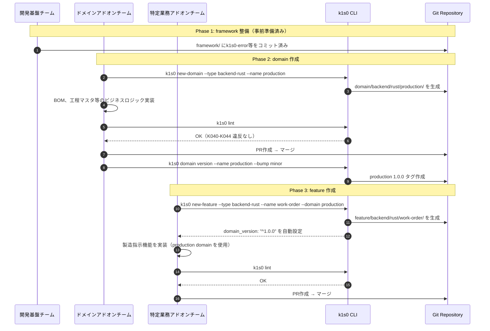
```mermaid
sequenceDiagram
    autonumber
    participant 基盤 as 開発基盤チーム
    participant ドメイン as ドメインアドオンチーム
    participant 業務 as 特定業務アドオンチーム
    participant CLI as k1s0 CLI
    participant Repo as Git Repository

    Note over 基盤,Repo: Phase 1: framework 整備（事前準備済み）
    基盤->>Repo: framework/ にk1s0-error等をコミット済み

    Note over ドメイン,Repo: Phase 2: domain 作成
    ドメイン->>CLI: k1s0 new-domain --type backend-rust --name production
    CLI->>Repo: domain/backend/rust/production/ を生成
    ドメイン->>ドメイン: BOM、工程マスタ等のビジネスロジック実装
    ドメイン->>CLI: k1s0 lint
    CLI-->>ドメイン: OK（K040-K044 違反なし）
    ドメイン->>Repo: PR作成 → マージ
    ドメイン->>CLI: k1s0 domain version --name production --bump minor
    CLI->>Repo: production 1.0.0 タグ作成

    Note over 業務,Repo: Phase 3: feature 作成
    業務->>CLI: k1s0 new-feature --type backend-rust --name work-order --domain production
    CLI->>Repo: feature/backend/rust/work-order/ を生成
    CLI-->>業務: domain_version: "^1.0.0" を自動設定
    業務->>業務: 製造指示機能を実装（production domain を使用）
    業務->>CLI: k1s0 lint
    CLI-->>業務: OK
    業務->>Repo: PR作成 → マージ
```

#### シナリオ2: domain のマイナーバージョンアップ（後方互換）

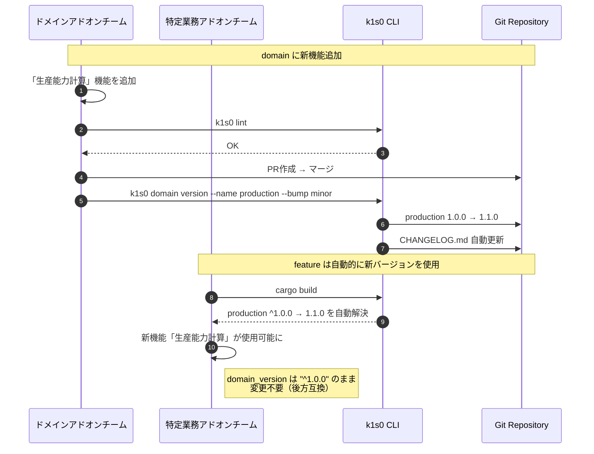
```mermaid
sequenceDiagram
    autonumber
    participant ドメイン as ドメインアドオンチーム
    participant 業務 as 特定業務アドオンチーム
    participant CLI as k1s0 CLI
    participant Repo as Git Repository

    Note over ドメイン,Repo: domain に新機能追加
    ドメイン->>ドメイン: 「生産能力計算」機能を追加
    ドメイン->>CLI: k1s0 lint
    CLI-->>ドメイン: OK
    ドメイン->>Repo: PR作成 → マージ
    ドメイン->>CLI: k1s0 domain version --name production --bump minor
    CLI->>Repo: production 1.0.0 → 1.1.0
    CLI->>Repo: CHANGELOG.md 自動更新

    Note over 業務,Repo: feature は自動的に新バージョンを使用
    業務->>CLI: cargo build
    CLI-->>業務: production ^1.0.0 → 1.1.0 を自動解決
    業務->>業務: 新機能「生産能力計算」が使用可能に
    Note right of 業務: domain_version は "^1.0.0" のまま<br/>変更不要（後方互換）
```

#### シナリオ3: domain のメジャーバージョンアップ（破壊的変更）

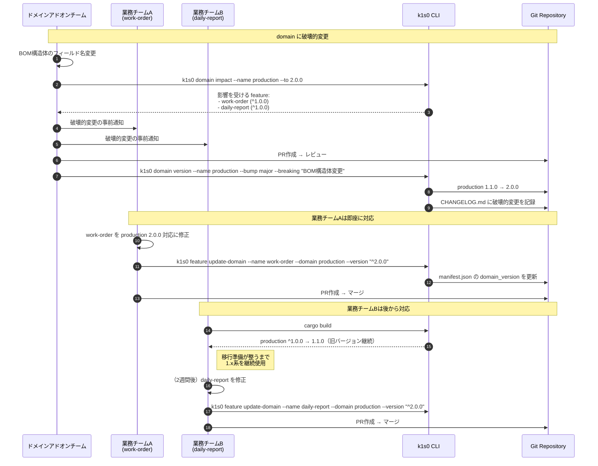
```mermaid
sequenceDiagram
    autonumber
    participant ドメイン as ドメインアドオンチーム
    participant 業務A as 業務チームA<br/>(work-order)
    participant 業務B as 業務チームB<br/>(daily-report)
    participant CLI as k1s0 CLI
    participant Repo as Git Repository

    Note over ドメイン,Repo: domain に破壊的変更
    ドメイン->>ドメイン: BOM構造体のフィールド名変更
    ドメイン->>CLI: k1s0 domain impact --name production --to 2.0.0
    CLI-->>ドメイン: 影響を受ける feature:<br/>- work-order (^1.0.0)<br/>- daily-report (^1.0.0)
    ドメイン->>業務A: 破壊的変更の事前通知
    ドメイン->>業務B: 破壊的変更の事前通知

    ドメイン->>Repo: PR作成 → レビュー
    ドメイン->>CLI: k1s0 domain version --name production --bump major --breaking "BOM構造体変更"
    CLI->>Repo: production 1.1.0 → 2.0.0
    CLI->>Repo: CHANGELOG.md に破壊的変更を記録

    Note over 業務A,Repo: 業務チームAは即座に対応
    業務A->>業務A: work-order を production 2.0.0 対応に修正
    業務A->>CLI: k1s0 feature update-domain --name work-order --domain production --version "^2.0.0"
    CLI->>Repo: manifest.json の domain_version を更新
    業務A->>Repo: PR作成 → マージ

    Note over 業務B,Repo: 業務チームBは後から対応
    業務B->>CLI: cargo build
    CLI-->>業務B: production ^1.0.0 → 1.1.0（旧バージョン継続）
    Note right of 業務B: 移行準備が整うまで<br/>1.x系を継続使用

    業務B->>業務B: （2週間後）daily-report を修正
    業務B->>CLI: k1s0 feature update-domain --name daily-report --domain production --version "^2.0.0"
    業務B->>Repo: PR作成 → マージ
```

#### シナリオ4: 依存違反の検出と修正

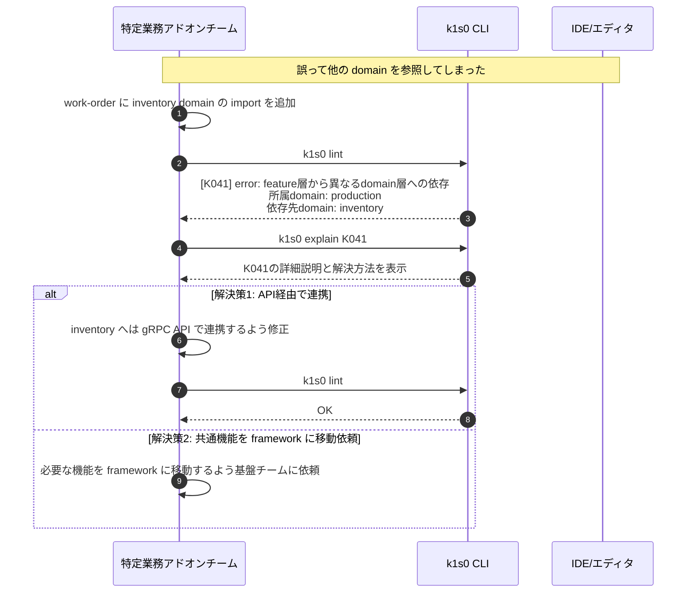
```mermaid
sequenceDiagram
    autonumber
    participant 業務 as 特定業務アドオンチーム
    participant CLI as k1s0 CLI
    participant IDE as IDE/エディタ

    Note over 業務,IDE: 誤って他の domain を参照してしまった
    業務->>業務: work-order に inventory domain の import を追加
    業務->>CLI: k1s0 lint
    CLI-->>業務: [K041] error: feature層から異なるdomain層への依存<br/>所属domain: production<br/>依存先domain: inventory

    業務->>CLI: k1s0 explain K041
    CLI-->>業務: K041の詳細説明と解決方法を表示

    alt 解決策1: API経由で連携
        業務->>業務: inventory へは gRPC API で連携するよう修正
        業務->>CLI: k1s0 lint
        CLI-->>業務: OK
    else 解決策2: 共通機能を framework に移動依頼
        業務->>業務: 必要な機能を framework に移動するよう基盤チームに依頼
    end
```

#### シナリオ5: 複数チームの並行開発

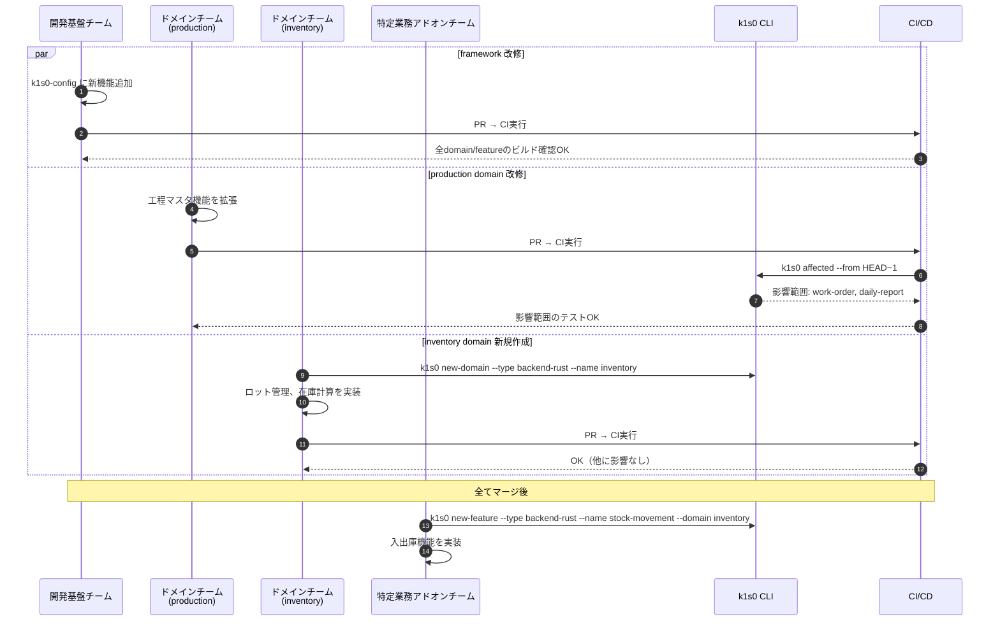
```mermaid
sequenceDiagram
    autonumber
    participant 基盤 as 開発基盤チーム
    participant ドメインP as ドメインチーム<br/>(production)
    participant ドメインI as ドメインチーム<br/>(inventory)
    participant 業務 as 特定業務アドオンチーム
    participant CLI as k1s0 CLI
    participant CI as CI/CD

    par framework 改修
        基盤->>基盤: k1s0-config に新機能追加
        基盤->>CI: PR → CI実行
        CI-->>基盤: 全domain/featureのビルド確認OK
    and production domain 改修
        ドメインP->>ドメインP: 工程マスタ機能を拡張
        ドメインP->>CI: PR → CI実行
        CI->>CLI: k1s0 affected --from HEAD~1
        CLI-->>CI: 影響範囲: work-order, daily-report
        CI-->>ドメインP: 影響範囲のテストOK
    and inventory domain 新規作成
        ドメインI->>CLI: k1s0 new-domain --type backend-rust --name inventory
        ドメインI->>ドメインI: ロット管理、在庫計算を実装
        ドメインI->>CI: PR → CI実行
        CI-->>ドメインI: OK（他に影響なし）
    end

    Note over 基盤,CI: 全てマージ後
    業務->>CLI: k1s0 new-feature --type backend-rust --name stock-movement --domain inventory
    業務->>業務: 入出庫機能を実装
```

#### シナリオ6: domain の昇格（feature → domain）

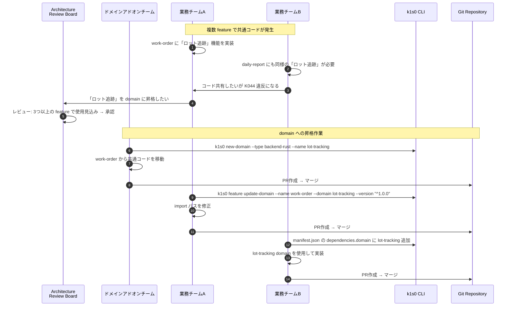
```mermaid
sequenceDiagram
    autonumber
    participant アーキ as Architecture<br/>Review Board
    participant ドメイン as ドメインアドオンチーム
    participant 業務A as 業務チームA
    participant 業務B as 業務チームB
    participant CLI as k1s0 CLI
    participant Repo as Git Repository

    Note over 業務A,業務B: 複数 feature で共通コードが発生
    業務A->>業務A: work-order に「ロット追跡」機能を実装
    業務B->>業務B: daily-report にも同様の「ロット追跡」が必要
    業務B->>業務A: コード共有したいが K044 違反になる

    業務A->>アーキ: 「ロット追跡」を domain に昇格したい
    アーキ->>アーキ: レビュー: 3つ以上の feature で使用見込み → 承認

    Note over ドメイン,Repo: domain への昇格作業
    ドメイン->>CLI: k1s0 new-domain --type backend-rust --name lot-tracking
    ドメイン->>ドメイン: work-order から共通コードを移動
    ドメイン->>Repo: PR作成 → マージ

    業務A->>CLI: k1s0 feature update-domain --name work-order --domain lot-tracking --version "^1.0.0"
    業務A->>業務A: import パスを修正
    業務A->>Repo: PR作成 → マージ

    業務B->>CLI: manifest.json の dependencies.domain に lot-tracking 追加
    業務B->>業務B: lot-tracking domain を使用して実装
    業務B->>Repo: PR作成 → マージ
```

#### シナリオ7: framework のマイナーバージョンアップ（後方互換）

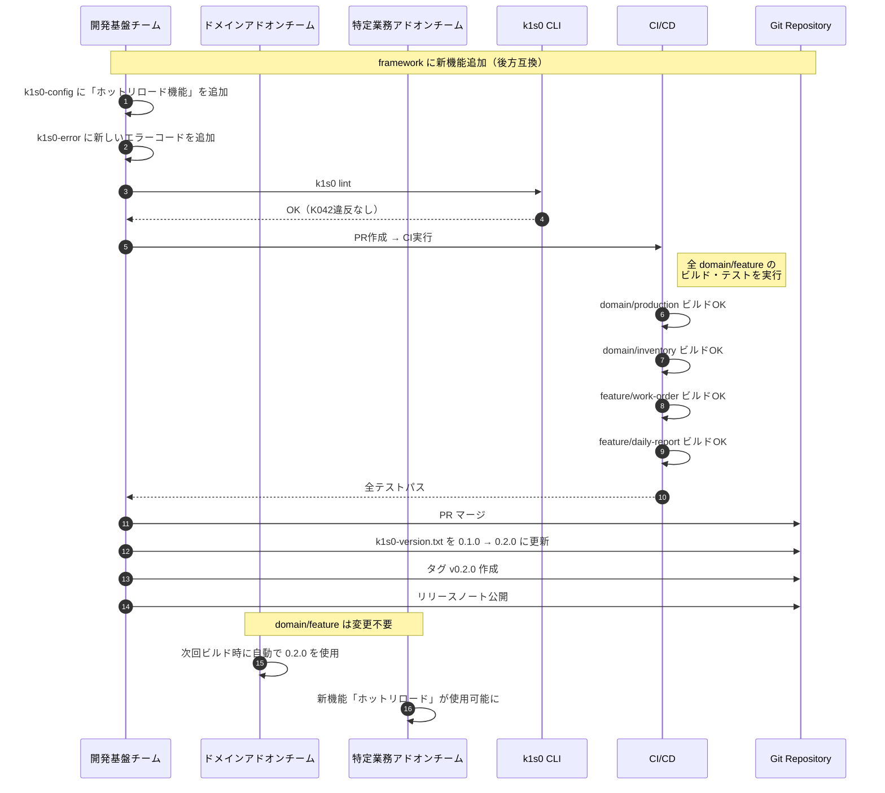
```mermaid
sequenceDiagram
    autonumber
    participant 基盤 as 開発基盤チーム
    participant ドメイン as ドメインアドオンチーム
    participant 業務 as 特定業務アドオンチーム
    participant CLI as k1s0 CLI
    participant CI as CI/CD
    participant Repo as Git Repository

    Note over 基盤,Repo: framework に新機能追加（後方互換）
    基盤->>基盤: k1s0-config に「ホットリロード機能」を追加
    基盤->>基盤: k1s0-error に新しいエラーコードを追加
    基盤->>CLI: k1s0 lint
    CLI-->>基盤: OK（K042違反なし）

    基盤->>CI: PR作成 → CI実行
    Note right of CI: 全 domain/feature の<br/>ビルド・テストを実行
    CI->>CI: domain/production ビルドOK
    CI->>CI: domain/inventory ビルドOK
    CI->>CI: feature/work-order ビルドOK
    CI->>CI: feature/daily-report ビルドOK
    CI-->>基盤: 全テストパス

    基盤->>Repo: PR マージ
    基盤->>Repo: k1s0-version.txt を 0.1.0 → 0.2.0 に更新
    基盤->>Repo: タグ v0.2.0 作成
    基盤->>Repo: リリースノート公開

    Note over ドメイン,業務: domain/feature は変更不要
    ドメイン->>ドメイン: 次回ビルド時に自動で 0.2.0 を使用
    業務->>業務: 新機能「ホットリロード」が使用可能に
```

#### シナリオ8: framework のメジャーバージョンアップ（破壊的変更）

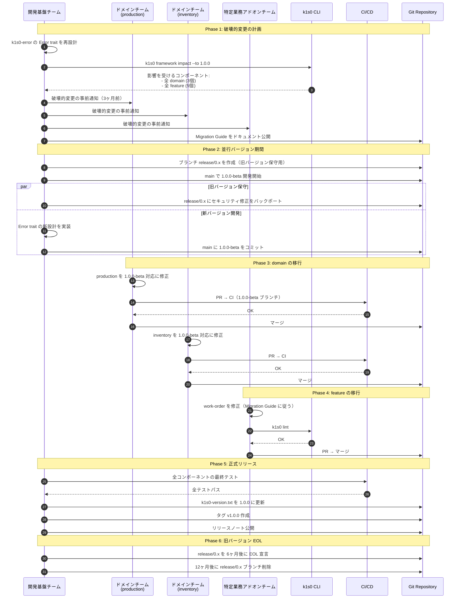
```mermaid
sequenceDiagram
    autonumber
    participant 基盤 as 開発基盤チーム
    participant ドメインP as ドメインチーム<br/>(production)
    participant ドメインI as ドメインチーム<br/>(inventory)
    participant 業務 as 特定業務アドオンチーム
    participant CLI as k1s0 CLI
    participant CI as CI/CD
    participant Repo as Git Repository

    Note over 基盤,Repo: Phase 1: 破壊的変更の計画
    基盤->>基盤: k1s0-error の Error trait を再設計
    基盤->>CLI: k1s0 framework impact --to 1.0.0
    CLI-->>基盤: 影響を受けるコンポーネント:<br/>- 全 domain (3個)<br/>- 全 feature (5個)

    基盤->>ドメインP: 破壊的変更の事前通知（3ヶ月前）
    基盤->>ドメインI: 破壊的変更の事前通知
    基盤->>業務: 破壊的変更の事前通知
    基盤->>Repo: Migration Guide をドキュメント公開

    Note over 基盤,Repo: Phase 2: 並行バージョン期間
    基盤->>Repo: ブランチ release/0.x を作成（旧バージョン保守用）
    基盤->>Repo: main で 1.0.0-beta 開発開始

    par 旧バージョン保守
        基盤->>Repo: release/0.x にセキュリティ修正をバックポート
    and 新バージョン開発
        基盤->>基盤: Error trait の新設計を実装
        基盤->>Repo: main に 1.0.0-beta をコミット
    end

    Note over ドメインP,Repo: Phase 3: domain の移行
    ドメインP->>ドメインP: production を 1.0.0-beta 対応に修正
    ドメインP->>CI: PR → CI（1.0.0-beta ブランチ）
    CI-->>ドメインP: OK
    ドメインP->>Repo: マージ

    ドメインI->>ドメインI: inventory を 1.0.0-beta 対応に修正
    ドメインI->>CI: PR → CI
    CI-->>ドメインI: OK
    ドメインI->>Repo: マージ

    Note over 業務,Repo: Phase 4: feature の移行
    業務->>業務: work-order を修正（Migration Guide に従う）
    業務->>CLI: k1s0 lint
    CLI-->>業務: OK
    業務->>Repo: PR → マージ

    Note over 基盤,Repo: Phase 5: 正式リリース
    基盤->>CI: 全コンポーネントの最終テスト
    CI-->>基盤: 全テストパス
    基盤->>Repo: k1s0-version.txt を 1.0.0 に更新
    基盤->>Repo: タグ v1.0.0 作成
    基盤->>Repo: リリースノート公開

    Note over 基盤,Repo: Phase 6: 旧バージョン EOL
    基盤->>Repo: release/0.x を 6ヶ月後に EOL 宣言
    基盤->>Repo: 12ヶ月後に release/0.x ブランチ削除
```

#### シナリオ9: framework の緊急セキュリティパッチ

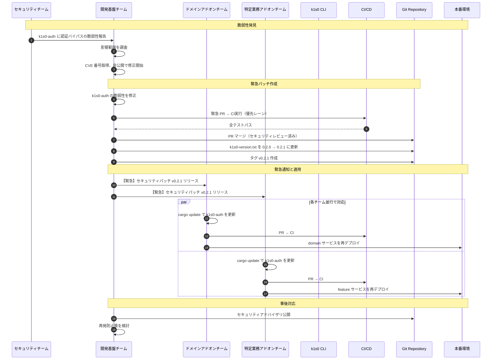
```mermaid
sequenceDiagram
    autonumber
    participant セキュリティ as セキュリティチーム
    participant 基盤 as 開発基盤チーム
    participant ドメイン as ドメインアドオンチーム
    participant 業務 as 特定業務アドオンチーム
    participant CLI as k1s0 CLI
    participant CI as CI/CD
    participant Repo as Git Repository
    participant 本番 as 本番環境

    Note over セキュリティ,本番: 脆弱性発見
    セキュリティ->>基盤: k1s0-auth に認証バイパスの脆弱性報告
    基盤->>基盤: 影響範囲を調査
    基盤->>基盤: CVE 番号取得、非公開で修正開始

    Note over 基盤,Repo: 緊急パッチ作成
    基盤->>基盤: k1s0-auth の脆弱性を修正
    基盤->>CI: 緊急 PR → CI実行（優先レーン）
    CI-->>基盤: 全テストパス
    基盤->>Repo: PR マージ（セキュリティレビュー済み）
    基盤->>Repo: k1s0-version.txt を 0.2.0 → 0.2.1 に更新
    基盤->>Repo: タグ v0.2.1 作成

    Note over 基盤,本番: 緊急通知と適用
    基盤->>ドメイン: 【緊急】セキュリティパッチ v0.2.1 リリース
    基盤->>業務: 【緊急】セキュリティパッチ v0.2.1 リリース

    par 各チーム並行で対応
        ドメイン->>ドメイン: cargo update で k1s0-auth を更新
        ドメイン->>CI: PR → CI
        ドメイン->>本番: domain サービスを再デプロイ
    and
        業務->>業務: cargo update で k1s0-auth を更新
        業務->>CI: PR → CI
        業務->>本番: feature サービスを再デプロイ
    end

    Note over 基盤,本番: 事後対応
    基盤->>Repo: セキュリティアドバイザリ公開
    基盤->>基盤: 再発防止策を検討
```

#### シナリオ10: テンプレートのアップグレード（k1s0 upgrade）

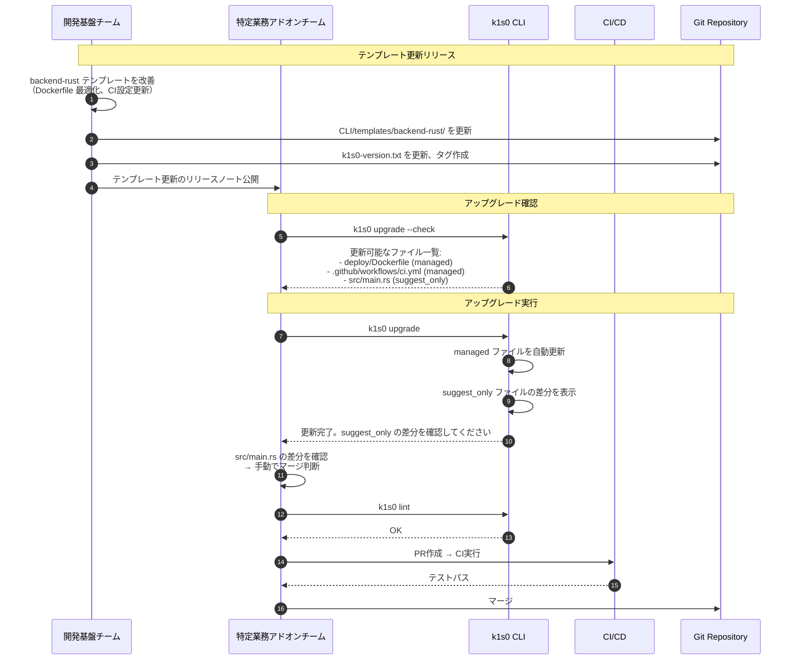
```mermaid
sequenceDiagram
    autonumber
    participant 基盤 as 開発基盤チーム
    participant 業務 as 特定業務アドオンチーム
    participant CLI as k1s0 CLI
    participant CI as CI/CD
    participant Repo as Git Repository

    Note over 基盤,Repo: テンプレート更新リリース
    基盤->>基盤: backend-rust テンプレートを改善<br/>（Dockerfile 最適化、CI設定更新）
    基盤->>Repo: CLI/templates/backend-rust/ を更新
    基盤->>Repo: k1s0-version.txt を更新、タグ作成
    基盤->>業務: テンプレート更新のリリースノート公開

    Note over 業務,Repo: アップグレード確認
    業務->>CLI: k1s0 upgrade --check
    CLI-->>業務: 更新可能なファイル一覧:<br/>- deploy/Dockerfile (managed)<br/>- .github/workflows/ci.yml (managed)<br/>- src/main.rs (suggest_only)

    Note over 業務,Repo: アップグレード実行
    業務->>CLI: k1s0 upgrade
    CLI->>CLI: managed ファイルを自動更新
    CLI->>CLI: suggest_only ファイルの差分を表示
    CLI-->>業務: 更新完了。suggest_only の差分を確認してください

    業務->>業務: src/main.rs の差分を確認<br/>→ 手動でマージ判断
    業務->>CLI: k1s0 lint
    CLI-->>業務: OK
    業務->>CI: PR作成 → CI実行
    CI-->>業務: テストパス
    業務->>Repo: マージ
```

#### シナリオ11: 既存 feature の domain 紐付け（マイグレーション）

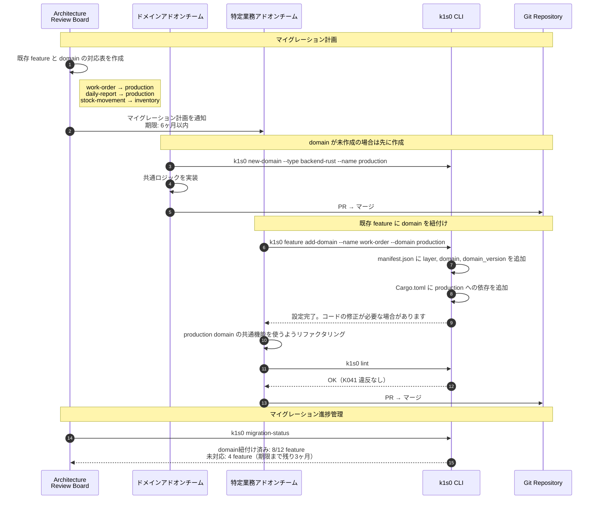
```mermaid
sequenceDiagram
    autonumber
    participant アーキ as Architecture<br/>Review Board
    participant ドメイン as ドメインアドオンチーム
    participant 業務 as 特定業務アドオンチーム
    participant CLI as k1s0 CLI
    participant Repo as Git Repository

    Note over アーキ,Repo: マイグレーション計画
    アーキ->>アーキ: 既存 feature と domain の対応表を作成
    Note right of アーキ: work-order → production<br/>daily-report → production<br/>stock-movement → inventory

    アーキ->>業務: マイグレーション計画を通知<br/>期限: 6ヶ月以内

    Note over ドメイン,Repo: domain が未作成の場合は先に作成
    ドメイン->>CLI: k1s0 new-domain --type backend-rust --name production
    ドメイン->>ドメイン: 共通ロジックを実装
    ドメイン->>Repo: PR → マージ

    Note over 業務,Repo: 既存 feature に domain を紐付け
    業務->>CLI: k1s0 feature add-domain --name work-order --domain production
    CLI->>CLI: manifest.json に layer, domain, domain_version を追加
    CLI->>CLI: Cargo.toml に production への依存を追加
    CLI-->>業務: 設定完了。コードの修正が必要な場合があります

    業務->>業務: production domain の共通機能を使うようリファクタリング
    業務->>CLI: k1s0 lint
    CLI-->>業務: OK（K041 違反なし）
    業務->>Repo: PR → マージ

    Note over アーキ,Repo: マイグレーション進捗管理
    アーキ->>CLI: k1s0 migration-status
    CLI-->>アーキ: domain紐付け済み: 8/12 feature<br/>未対応: 4 feature（期限まで残り3ヶ月）
```

#### シナリオ12: バグ修正フロー（domain 起因 vs feature 起因の切り分け）

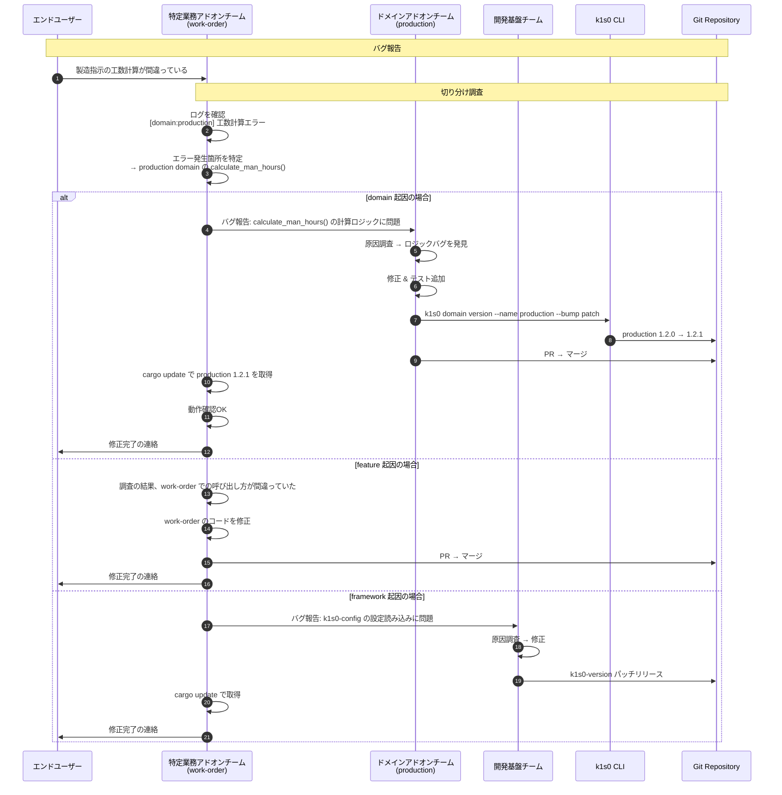
```mermaid
sequenceDiagram
    autonumber
    participant ユーザー as エンドユーザー
    participant 業務 as 特定業務アドオンチーム<br/>(work-order)
    participant ドメイン as ドメインアドオンチーム<br/>(production)
    participant 基盤 as 開発基盤チーム
    participant CLI as k1s0 CLI
    participant Repo as Git Repository

    Note over ユーザー,Repo: バグ報告
    ユーザー->>業務: 製造指示の工数計算が間違っている

    Note over 業務,Repo: 切り分け調査
    業務->>業務: ログを確認<br/>[domain:production] 工数計算エラー
    業務->>業務: エラー発生箇所を特定<br/>→ production domain の calculate_man_hours()

    alt domain 起因の場合
        業務->>ドメイン: バグ報告: calculate_man_hours() の計算ロジックに問題
        ドメイン->>ドメイン: 原因調査 → ロジックバグを発見
        ドメイン->>ドメイン: 修正 & テスト追加
        ドメイン->>CLI: k1s0 domain version --name production --bump patch
        CLI->>Repo: production 1.2.0 → 1.2.1
        ドメイン->>Repo: PR → マージ

        業務->>業務: cargo update で production 1.2.1 を取得
        業務->>業務: 動作確認OK
        業務->>ユーザー: 修正完了の連絡

    else feature 起因の場合
        業務->>業務: 調査の結果、work-order での呼び出し方が間違っていた
        業務->>業務: work-order のコードを修正
        業務->>Repo: PR → マージ
        業務->>ユーザー: 修正完了の連絡

    else framework 起因の場合
        業務->>基盤: バグ報告: k1s0-config の設定読み込みに問題
        基盤->>基盤: 原因調査 → 修正
        基盤->>Repo: k1s0-version パッチリリース
        業務->>業務: cargo update で取得
        業務->>ユーザー: 修正完了の連絡
    end
```

#### シナリオ13: domain の廃止・非推奨化

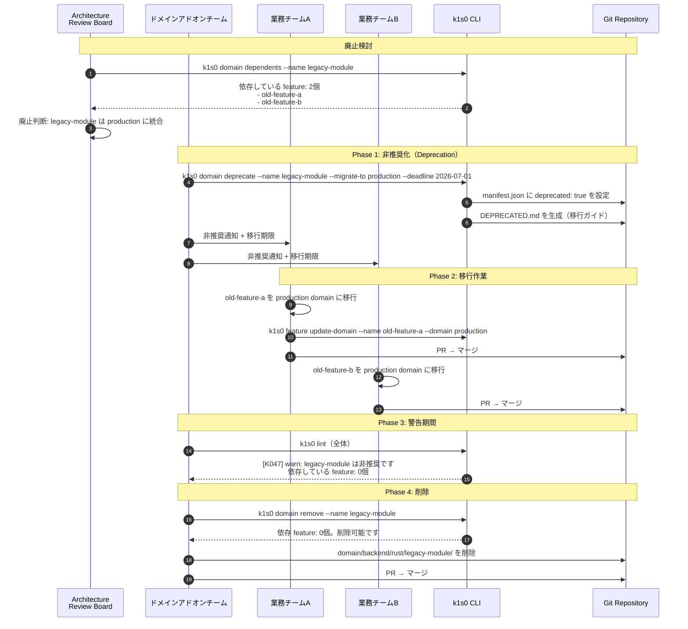
```mermaid
sequenceDiagram
    autonumber
    participant アーキ as Architecture<br/>Review Board
    participant ドメイン as ドメインアドオンチーム
    participant 業務A as 業務チームA
    participant 業務B as 業務チームB
    participant CLI as k1s0 CLI
    participant Repo as Git Repository

    Note over アーキ,Repo: 廃止検討
    アーキ->>CLI: k1s0 domain dependents --name legacy-module
    CLI-->>アーキ: 依存している feature: 2個<br/>- old-feature-a<br/>- old-feature-b
    アーキ->>アーキ: 廃止判断: legacy-module は production に統合

    Note over ドメイン,Repo: Phase 1: 非推奨化（Deprecation）
    ドメイン->>CLI: k1s0 domain deprecate --name legacy-module --migrate-to production --deadline 2026-07-01
    CLI->>Repo: manifest.json に deprecated: true を設定
    CLI->>Repo: DEPRECATED.md を生成（移行ガイド）
    ドメイン->>業務A: 非推奨通知 + 移行期限
    ドメイン->>業務B: 非推奨通知 + 移行期限

    Note over 業務A,Repo: Phase 2: 移行作業
    業務A->>業務A: old-feature-a を production domain に移行
    業務A->>CLI: k1s0 feature update-domain --name old-feature-a --domain production
    業務A->>Repo: PR → マージ

    業務B->>業務B: old-feature-b を production domain に移行
    業務B->>Repo: PR → マージ

    Note over ドメイン,Repo: Phase 3: 警告期間
    ドメイン->>CLI: k1s0 lint（全体）
    CLI-->>ドメイン: [K047] warn: legacy-module は非推奨です<br/>依存している feature: 0個

    Note over ドメイン,Repo: Phase 4: 削除
    ドメイン->>CLI: k1s0 domain remove --name legacy-module
    CLI-->>ドメイン: 依存 feature: 0個。削除可能です
    ドメイン->>Repo: domain/backend/rust/legacy-module/ を削除
    ドメイン->>Repo: PR → マージ
```

#### シナリオ14: 本番デプロイとロールバック

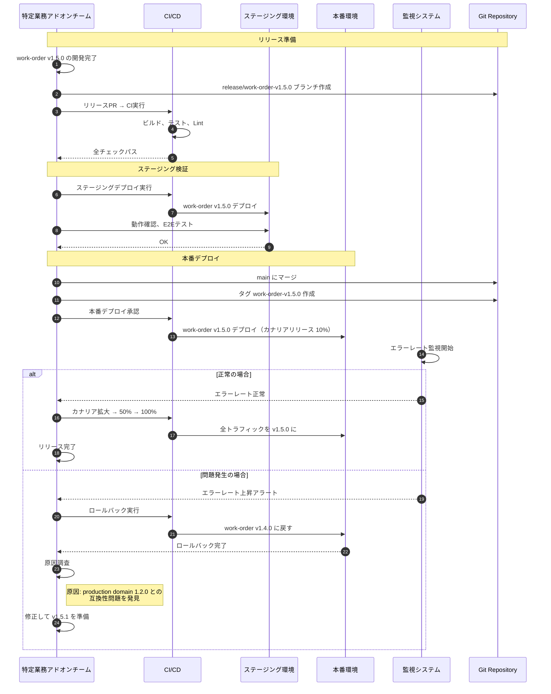
```mermaid
sequenceDiagram
    autonumber
    participant 業務 as 特定業務アドオンチーム
    participant CI as CI/CD
    participant ステージング as ステージング環境
    participant 本番 as 本番環境
    participant 監視 as 監視システム
    participant Repo as Git Repository

    Note over 業務,Repo: リリース準備
    業務->>業務: work-order v1.5.0 の開発完了
    業務->>Repo: release/work-order-v1.5.0 ブランチ作成
    業務->>CI: リリースPR → CI実行
    CI->>CI: ビルド、テスト、Lint
    CI-->>業務: 全チェックパス

    Note over 業務,ステージング: ステージング検証
    業務->>CI: ステージングデプロイ実行
    CI->>ステージング: work-order v1.5.0 デプロイ
    業務->>ステージング: 動作確認、E2Eテスト
    ステージング-->>業務: OK

    Note over 業務,本番: 本番デプロイ
    業務->>Repo: main にマージ
    業務->>Repo: タグ work-order-v1.5.0 作成
    業務->>CI: 本番デプロイ承認
    CI->>本番: work-order v1.5.0 デプロイ（カナリアリリース 10%）
    監視->>監視: エラーレート監視開始

    alt 正常の場合
        監視-->>業務: エラーレート正常
        業務->>CI: カナリア拡大 → 50% → 100%
        CI->>本番: 全トラフィックを v1.5.0 に
        業務->>業務: リリース完了
    else 問題発生の場合
        監視-->>業務: エラーレート上昇アラート
        業務->>CI: ロールバック実行
        CI->>本番: work-order v1.4.0 に戻す
        本番-->>業務: ロールバック完了

        業務->>業務: 原因調査
        Note right of 業務: 原因: production domain 1.2.0 との<br/>互換性問題を発見
        業務->>業務: 修正して v1.5.1 を準備
    end
```

#### シナリオ15: 複数 domain を使いたい場合の対処

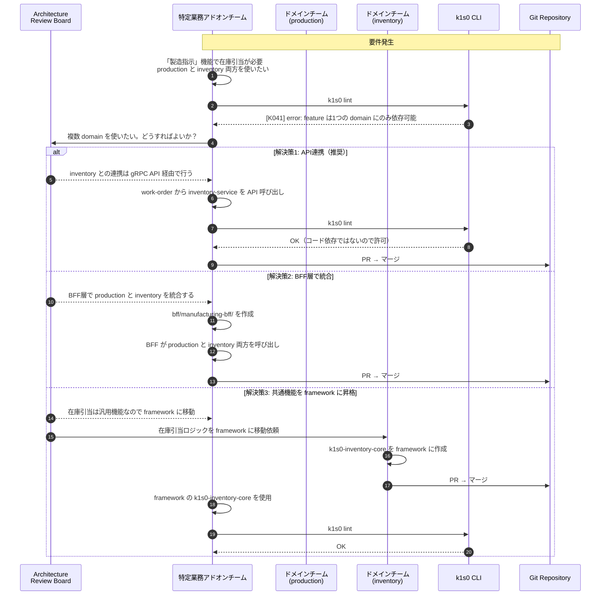
```mermaid
sequenceDiagram
    autonumber
    participant アーキ as Architecture<br/>Review Board
    participant 業務 as 特定業務アドオンチーム
    participant ドメインP as ドメインチーム<br/>(production)
    participant ドメインI as ドメインチーム<br/>(inventory)
    participant CLI as k1s0 CLI
    participant Repo as Git Repository

    Note over 業務,Repo: 要件発生
    業務->>業務: 「製造指示」機能で在庫引当が必要<br/>production と inventory 両方を使いたい

    業務->>CLI: k1s0 lint
    CLI-->>業務: [K041] error: feature は1つの domain にのみ依存可能

    業務->>アーキ: 複数 domain を使いたい。どうすればよいか？

    alt 解決策1: API連携（推奨）
        アーキ-->>業務: inventory との連携は gRPC API 経由で行う
        業務->>業務: work-order から inventory-service を API 呼び出し
        業務->>CLI: k1s0 lint
        CLI-->>業務: OK（コード依存ではないので許可）
        業務->>Repo: PR → マージ

    else 解決策2: BFF層で統合
        アーキ-->>業務: BFF層で production と inventory を統合する
        業務->>業務: bff/manufacturing-bff/ を作成
        業務->>業務: BFF が production と inventory 両方を呼び出し
        業務->>Repo: PR → マージ

    else 解決策3: 共通機能を framework に昇格
        アーキ-->>業務: 在庫引当は汎用機能なので framework に移動
        アーキ->>ドメインI: 在庫引当ロジックを framework に移動依頼
        ドメインI->>ドメインI: k1s0-inventory-core を framework に作成
        ドメインI->>Repo: PR → マージ
        業務->>業務: framework の k1s0-inventory-core を使用
        業務->>CLI: k1s0 lint
        CLI-->>業務: OK
    end
```

#### シナリオ16: 新人オンボーディング（開発環境セットアップ）

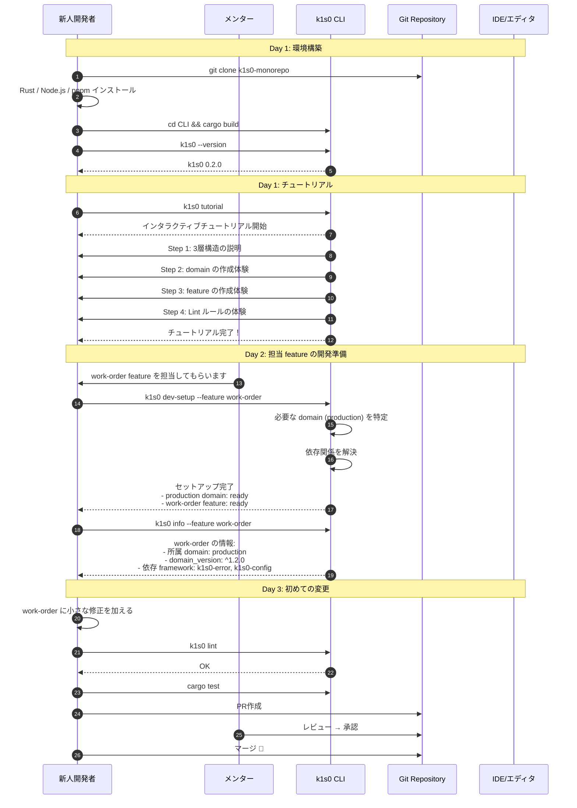
```mermaid
sequenceDiagram
    autonumber
    participant 新人 as 新人開発者
    participant メンター as メンター
    participant CLI as k1s0 CLI
    participant Repo as Git Repository
    participant IDE as IDE/エディタ

    Note over 新人,IDE: Day 1: 環境構築
    新人->>Repo: git clone k1s0-monorepo
    新人->>新人: Rust / Node.js / pnpm インストール
    新人->>CLI: cd CLI && cargo build
    新人->>CLI: k1s0 --version
    CLI-->>新人: k1s0 0.2.0

    Note over 新人,IDE: Day 1: チュートリアル
    新人->>CLI: k1s0 tutorial
    CLI-->>新人: インタラクティブチュートリアル開始
    CLI->>新人: Step 1: 3層構造の説明
    CLI->>新人: Step 2: domain の作成体験
    CLI->>新人: Step 3: feature の作成体験
    CLI->>新人: Step 4: Lint ルールの体験
    CLI-->>新人: チュートリアル完了！

    Note over 新人,IDE: Day 2: 担当 feature の開発準備
    メンター->>新人: work-order feature を担当してもらいます
    新人->>CLI: k1s0 dev-setup --feature work-order
    CLI->>CLI: 必要な domain (production) を特定
    CLI->>CLI: 依存関係を解決
    CLI-->>新人: セットアップ完了<br/>- production domain: ready<br/>- work-order feature: ready

    新人->>CLI: k1s0 info --feature work-order
    CLI-->>新人: work-order の情報:<br/>- 所属 domain: production<br/>- domain_version: ^1.2.0<br/>- 依存 framework: k1s0-error, k1s0-config

    Note over 新人,IDE: Day 3: 初めての変更
    新人->>新人: work-order に小さな修正を加える
    新人->>CLI: k1s0 lint
    CLI-->>新人: OK
    新人->>CLI: cargo test
    新人->>Repo: PR作成
    メンター->>Repo: レビュー → 承認
    新人->>Repo: マージ 🎉
```

#### シナリオ17: feature の廃止

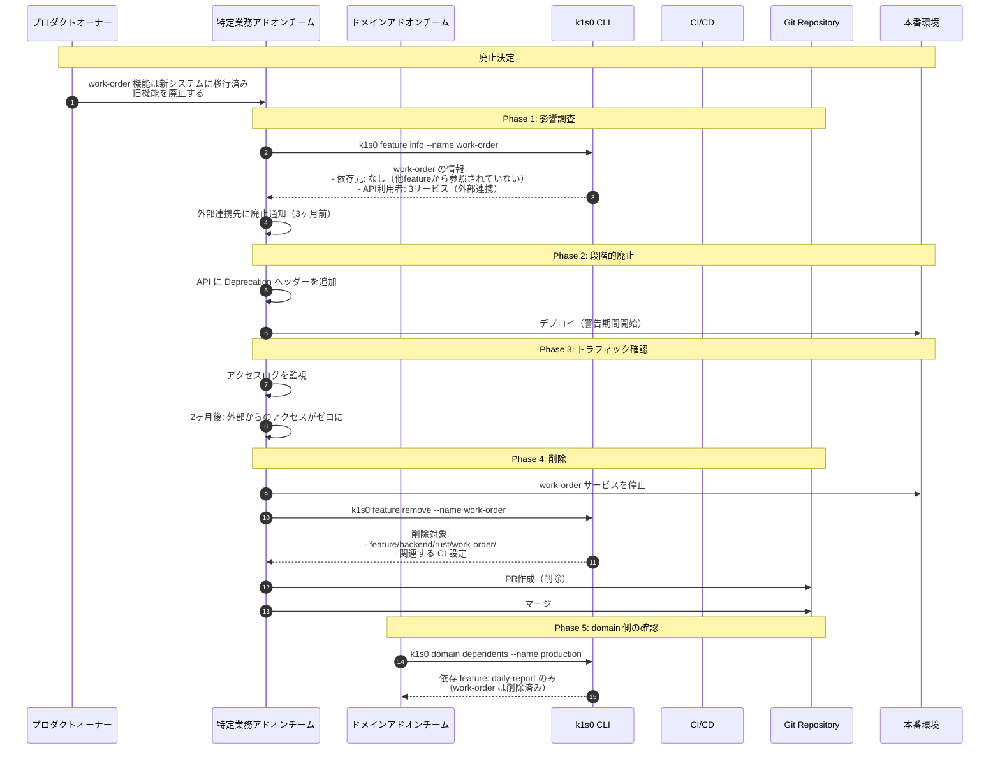
```mermaid
sequenceDiagram
    autonumber
    participant PO as プロダクトオーナー
    participant 業務 as 特定業務アドオンチーム
    participant ドメイン as ドメインアドオンチーム
    participant CLI as k1s0 CLI
    participant CI as CI/CD
    participant Repo as Git Repository
    participant 本番 as 本番環境

    Note over PO,本番: 廃止決定
    PO->>業務: work-order 機能は新システムに移行済み<br/>旧機能を廃止する

    Note over 業務,Repo: Phase 1: 影響調査
    業務->>CLI: k1s0 feature info --name work-order
    CLI-->>業務: work-order の情報:<br/>- 依存元: なし（他featureから参照されていない）<br/>- API利用者: 3サービス（外部連携）

    業務->>業務: 外部連携先に廃止通知（3ヶ月前）

    Note over 業務,本番: Phase 2: 段階的廃止
    業務->>業務: API に Deprecation ヘッダーを追加
    業務->>本番: デプロイ（警告期間開始）

    Note over 業務,本番: Phase 3: トラフィック確認
    業務->>業務: アクセスログを監視
    業務->>業務: 2ヶ月後: 外部からのアクセスがゼロに

    Note over 業務,Repo: Phase 4: 削除
    業務->>本番: work-order サービスを停止
    業務->>CLI: k1s0 feature remove --name work-order
    CLI-->>業務: 削除対象:<br/>- feature/backend/rust/work-order/<br/>- 関連する CI 設定
    業務->>Repo: PR作成（削除）
    業務->>Repo: マージ

    Note over ドメイン,Repo: Phase 5: domain 側の確認
    ドメイン->>CLI: k1s0 domain dependents --name production
    CLI-->>ドメイン: 依存 feature: daily-report のみ<br/>（work-order は削除済み）
```

#### シナリオ18: domain の分割

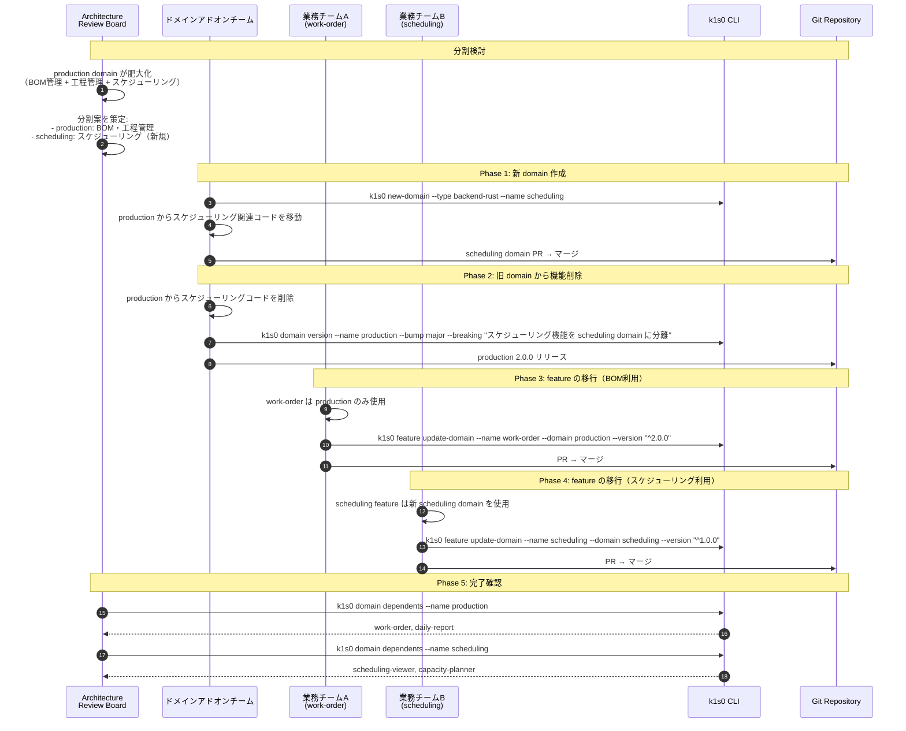
```mermaid
sequenceDiagram
    autonumber
    participant アーキ as Architecture<br/>Review Board
    participant ドメイン as ドメインアドオンチーム
    participant 業務A as 業務チームA<br/>(work-order)
    participant 業務B as 業務チームB<br/>(scheduling)
    participant CLI as k1s0 CLI
    participant Repo as Git Repository

    Note over アーキ,Repo: 分割検討
    アーキ->>アーキ: production domain が肥大化<br/>（BOM管理 + 工程管理 + スケジューリング）
    アーキ->>アーキ: 分割案を策定:<br/>- production: BOM・工程管理<br/>- scheduling: スケジューリング（新規）

    Note over ドメイン,Repo: Phase 1: 新 domain 作成
    ドメイン->>CLI: k1s0 new-domain --type backend-rust --name scheduling
    ドメイン->>ドメイン: production からスケジューリング関連コードを移動
    ドメイン->>Repo: scheduling domain PR → マージ

    Note over ドメイン,Repo: Phase 2: 旧 domain から機能削除
    ドメイン->>ドメイン: production からスケジューリングコードを削除
    ドメイン->>CLI: k1s0 domain version --name production --bump major --breaking "スケジューリング機能を scheduling domain に分離"
    ドメイン->>Repo: production 2.0.0 リリース

    Note over 業務A,Repo: Phase 3: feature の移行（BOM利用）
    業務A->>業務A: work-order は production のみ使用
    業務A->>CLI: k1s0 feature update-domain --name work-order --domain production --version "^2.0.0"
    業務A->>Repo: PR → マージ

    Note over 業務B,Repo: Phase 4: feature の移行（スケジューリング利用）
    業務B->>業務B: scheduling feature は新 scheduling domain を使用
    業務B->>CLI: k1s0 feature update-domain --name scheduling --domain scheduling --version "^1.0.0"
    業務B->>Repo: PR → マージ

    Note over アーキ,Repo: Phase 5: 完了確認
    アーキ->>CLI: k1s0 domain dependents --name production
    CLI-->>アーキ: work-order, daily-report
    アーキ->>CLI: k1s0 domain dependents --name scheduling
    CLI-->>アーキ: scheduling-viewer, capacity-planner
```

#### シナリオ19: フロントエンド/バックエンド連携開発

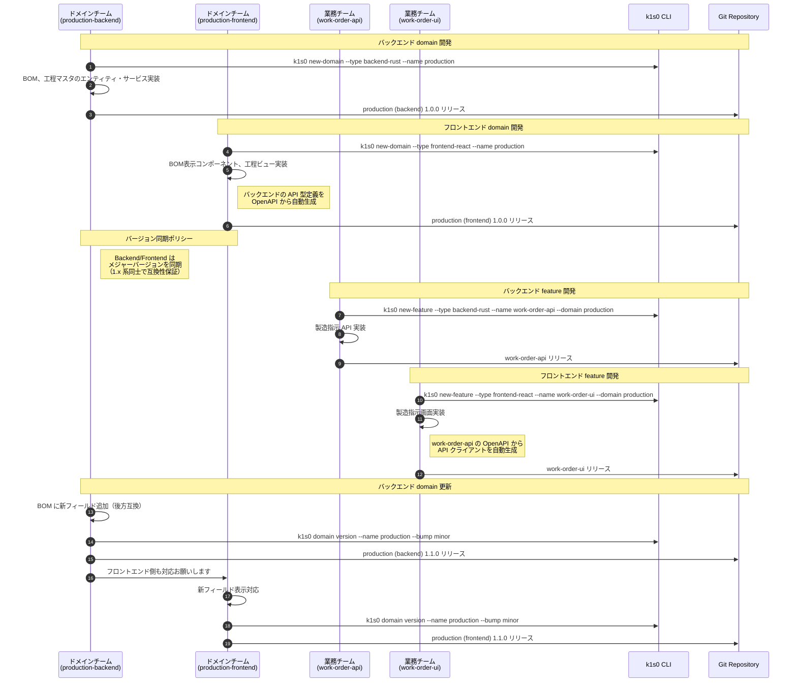
```mermaid
sequenceDiagram
    autonumber
    participant ドメインBE as ドメインチーム<br/>(production-backend)
    participant ドメインFE as ドメインチーム<br/>(production-frontend)
    participant 業務BE as 業務チーム<br/>(work-order-api)
    participant 業務FE as 業務チーム<br/>(work-order-ui)
    participant CLI as k1s0 CLI
    participant Repo as Git Repository

    Note over ドメインBE,Repo: バックエンド domain 開発
    ドメインBE->>CLI: k1s0 new-domain --type backend-rust --name production
    ドメインBE->>ドメインBE: BOM、工程マスタのエンティティ・サービス実装
    ドメインBE->>Repo: production (backend) 1.0.0 リリース

    Note over ドメインFE,Repo: フロントエンド domain 開発
    ドメインFE->>CLI: k1s0 new-domain --type frontend-react --name production
    ドメインFE->>ドメインFE: BOM表示コンポーネント、工程ビュー実装
    Note right of ドメインFE: バックエンドの API 型定義を<br/>OpenAPI から自動生成
    ドメインFE->>Repo: production (frontend) 1.0.0 リリース

    Note over ドメインBE,ドメインFE: バージョン同期ポリシー
    Note right of ドメインBE: Backend/Frontend は<br/>メジャーバージョンを同期<br/>（1.x 系同士で互換性保証）

    Note over 業務BE,Repo: バックエンド feature 開発
    業務BE->>CLI: k1s0 new-feature --type backend-rust --name work-order-api --domain production
    業務BE->>業務BE: 製造指示 API 実装
    業務BE->>Repo: work-order-api リリース

    Note over 業務FE,Repo: フロントエンド feature 開発
    業務FE->>CLI: k1s0 new-feature --type frontend-react --name work-order-ui --domain production
    業務FE->>業務FE: 製造指示画面実装
    Note right of 業務FE: work-order-api の OpenAPI から<br/>API クライアントを自動生成
    業務FE->>Repo: work-order-ui リリース

    Note over ドメインBE,Repo: バックエンド domain 更新
    ドメインBE->>ドメインBE: BOM に新フィールド追加（後方互換）
    ドメインBE->>CLI: k1s0 domain version --name production --bump minor
    ドメインBE->>Repo: production (backend) 1.1.0 リリース
    ドメインBE->>ドメインFE: フロントエンド側も対応お願いします

    ドメインFE->>ドメインFE: 新フィールド表示対応
    ドメインFE->>CLI: k1s0 domain version --name production --bump minor
    ドメインFE->>Repo: production (frontend) 1.1.0 リリース
```

#### シナリオ20: API契約（Proto/OpenAPI）の変更

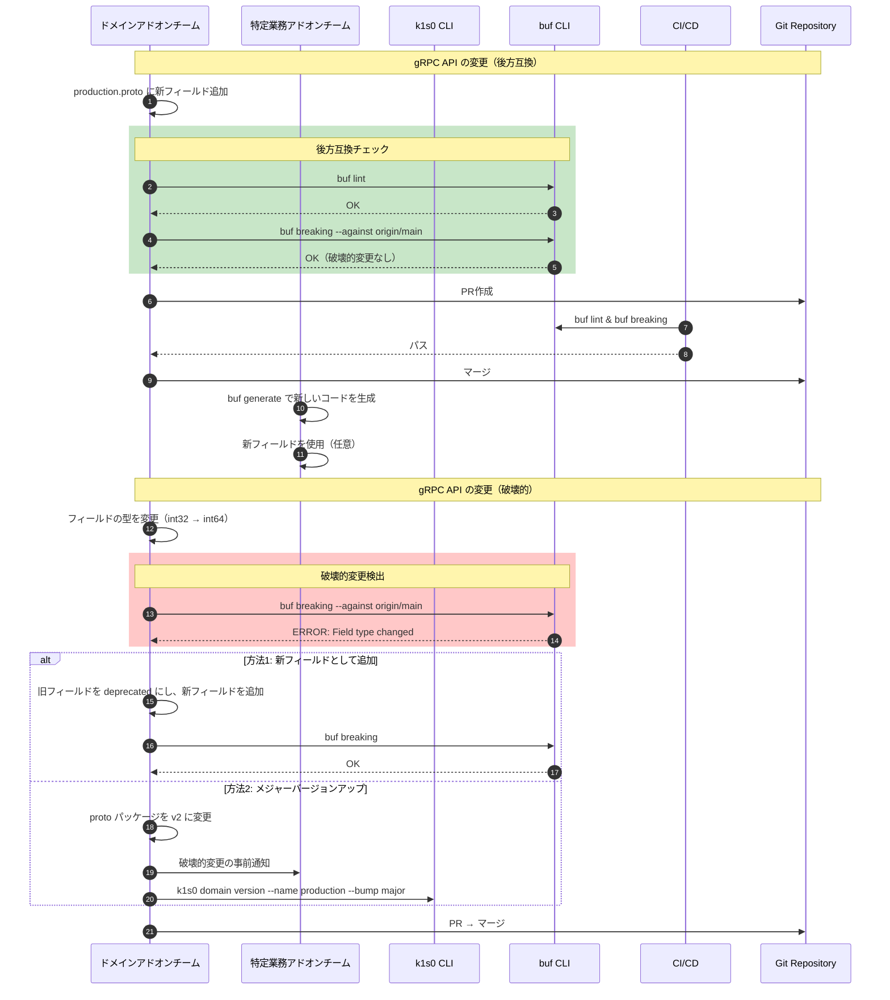
```mermaid
sequenceDiagram
    autonumber
    participant ドメイン as ドメインアドオンチーム
    participant 業務 as 特定業務アドオンチーム
    participant CLI as k1s0 CLI
    participant Buf as buf CLI
    participant CI as CI/CD
    participant Repo as Git Repository

    Note over ドメイン,Repo: gRPC API の変更（後方互換）
    ドメイン->>ドメイン: production.proto に新フィールド追加

    rect rgb(200, 230, 200)
        Note over ドメイン,Buf: 後方互換チェック
        ドメイン->>Buf: buf lint
        Buf-->>ドメイン: OK
        ドメイン->>Buf: buf breaking --against origin/main
        Buf-->>ドメイン: OK（破壊的変更なし）
    end

    ドメイン->>Repo: PR作成
    CI->>Buf: buf lint & buf breaking
    CI-->>ドメイン: パス
    ドメイン->>Repo: マージ

    業務->>業務: buf generate で新しいコードを生成
    業務->>業務: 新フィールドを使用（任意）

    Note over ドメイン,Repo: gRPC API の変更（破壊的）
    ドメイン->>ドメイン: フィールドの型を変更（int32 → int64）

    rect rgb(255, 200, 200)
        Note over ドメイン,Buf: 破壊的変更検出
        ドメイン->>Buf: buf breaking --against origin/main
        Buf-->>ドメイン: ERROR: Field type changed
    end

    alt 方法1: 新フィールドとして追加
        ドメイン->>ドメイン: 旧フィールドを deprecated にし、新フィールドを追加
        ドメイン->>Buf: buf breaking
        Buf-->>ドメイン: OK
    else 方法2: メジャーバージョンアップ
        ドメイン->>ドメイン: proto パッケージを v2 に変更
        ドメイン->>業務: 破壊的変更の事前通知
        ドメイン->>CLI: k1s0 domain version --name production --bump major
    end

    ドメイン->>Repo: PR → マージ
```

#### シナリオ21: データベースマイグレーション

```mermaid
sequenceDiagram
    autonumber
    participant ドメイン as ドメインアドオンチーム
    participant 業務 as 特定業務アドオンチーム
    participant CLI as k1s0 CLI
    participant CI as CI/CD
    participant DB as データベース
    participant Repo as Git Repository

    Note over ドメイン,DB: domain レベルのマイグレーション（マスタテーブル）
    ドメイン->>ドメイン: m_process（工程マスタ）に新カラム追加
    ドメイン->>ドメイン: domain/backend/rust/production/migrations/<br/>20260128_add_column_to_process.sql 作成

    rect rgb(200, 230, 200)
        Note over ドメイン,DB: 後方互換チェック
        ドメイン->>ドメイン: 新カラムは NULL 許可 or デフォルト値あり → OK
    end

    ドメイン->>Repo: PR作成
    CI->>DB: マイグレーション dry-run（テストDB）
    CI-->>ドメイン: OK
    ドメイン->>Repo: マージ

    ドメイン->>CLI: k1s0 domain version --name production --bump minor
    ドメイン->>業務: マイグレーション v1.3.0 リリース通知

    Note over 業務,DB: feature レベルのマイグレーション（トランザクションテーブル）
    業務->>業務: t_work_order に新カラム追加
    業務->>業務: feature/backend/rust/work-order/migrations/<br/>20260128_add_status_column.sql 作成
    業務->>Repo: PR作成
    CI->>DB: マイグレーション dry-run
    CI-->>業務: OK
    業務->>Repo: マージ

    Note over ドメイン,DB: 本番適用の順序
    Note right of DB: 1. domain マイグレーション実行<br/>2. domain サービスデプロイ<br/>3. feature マイグレーション実行<br/>4. feature サービスデプロイ

    rect rgb(255, 230, 200)
        Note over ドメイン,DB: 破壊的マイグレーション（カラム削除）の場合
        ドメイン->>ドメイン: Phase 1: カラムを deprecated 扱い
        ドメイン->>業務: 3ヶ月以内に参照を削除してください
        業務->>業務: 該当カラムの参照を削除
        業務->>Repo: PR → マージ
        ドメイン->>ドメイン: Phase 2: カラム削除マイグレーション
        ドメイン->>CLI: k1s0 domain version --name production --bump major
    end
```

#### シナリオ22: 設定変更（config）の反映

```mermaid
sequenceDiagram
    autonumber
    participant 業務 as 特定業務アドオンチーム
    participant CLI as k1s0 CLI
    participant CI as CI/CD
    participant ステージング as ステージング環境
    participant 本番 as 本番環境
    participant Repo as Git Repository

    Note over 業務,Repo: 設定ファイルの変更
    業務->>業務: config/prod.yaml のタイムアウト値を変更

    rect rgb(200, 230, 200)
        Note over 業務,CLI: 設定検証
        業務->>CLI: k1s0 config validate --env prod
        CLI-->>業務: OK（スキーマ準拠、必須項目あり）

        業務->>CLI: k1s0 config diff --env prod
        CLI-->>業務: 変更点:<br/>- server.timeout: 30s → 60s
    end

    業務->>Repo: PR作成
    CI->>CLI: k1s0 config validate
    CI-->>業務: OK
    業務->>Repo: マージ

    Note over 業務,ステージング: ステージング確認
    業務->>ステージング: 設定変更を含むデプロイ
    業務->>ステージング: 動作確認（タイムアウト挙動）
    ステージング-->>業務: OK

    Note over 業務,本番: 本番適用
    業務->>本番: デプロイ
    業務->>業務: 設定変更が反映されたことを確認

    Note over 業務,本番: 機密情報の変更（password_file 参照先）
    業務->>業務: DB パスワードのローテーション
    業務->>業務: /var/run/secrets/db_password を更新（k8s Secret）
    Note right of 業務: config/prod.yaml は変更不要<br/>（password_file パスは同じ）
    業務->>本番: Pod 再起動で新パスワード読み込み
```

#### シナリオ23: 障害発生時のエスカレーション

```mermaid
sequenceDiagram
    autonumber
    participant 監視 as 監視システム
    participant オンコール as オンコール担当
    participant 業務 as 特定業務アドオンチーム
    participant ドメイン as ドメインアドオンチーム
    participant 基盤 as 開発基盤チーム
    participant 本番 as 本番環境

    Note over 監視,本番: 障害検知
    監視->>オンコール: アラート: work-order API エラー率上昇

    オンコール->>本番: ログ確認
    本番-->>オンコール: [feature:work-order] DB connection error<br/>[framework:k1s0-db] Pool exhausted

    Note over オンコール,基盤: 切り分けと担当特定
    オンコール->>オンコール: エラーログの層プレフィックスを確認

    alt feature 層の問題
        オンコール->>業務: エスカレーション
        業務->>業務: work-order の DB クエリを調査
    else domain 層の問題
        オンコール->>ドメイン: エスカレーション
        ドメイン->>ドメイン: production domain のロジックを調査
    else framework 層の問題
        オンコール->>基盤: エスカレーション
        基盤->>基盤: k1s0-db のコネクションプール設定を調査
        基盤->>基盤: 原因: プールサイズ不足
        基盤->>本番: 設定変更でプールサイズ拡大
        本番-->>監視: エラー率正常化
    end

    Note over オンコール,基盤: 事後対応
    基盤->>基盤: k1s0-db のデフォルトプールサイズを見直し
    基盤->>基盤: ポストモーテム作成
```

---

## 現状分析

### 現行ディレクトリ構造

```
k1s0/
├── CLI/                          # CLI ツール
│   ├── crates/
│   │   ├── k1s0-cli/            # メイン CLI
│   │   ├── k1s0-generator/      # テンプレートエンジン
│   │   └── k1s0-lsp/            # LSP サーバー
│   └── templates/               # サービステンプレート
│       ├── backend-rust/
│       ├── backend-go/
│       ├── frontend-react/
│       └── frontend-flutter/
│
├── framework/                    # 共通基盤
│   ├── backend/
│   │   ├── rust/crates/         # Rust 共通クレート（11個）
│   │   ├── rust/services/       # 共通マイクロサービス
│   │   └── go/pkg/              # Go 共通パッケージ
│   └── frontend/
│       ├── react/packages/      # React 共通パッケージ（8個）
│       └── flutter/packages/    # Flutter 共通パッケージ
│
├── feature/                      # 個別業務機能
│   ├── backend/rust/
│   ├── backend/go/
│   ├── frontend/react/
│   └── frontend/flutter/
│
└── bff/                          # Backend For Frontend
```

### 現行の依存関係

```
feature/* → framework/*  （許可）
feature/* → feature/*    （禁止、ただし強制なし）
framework/* → feature/*  （禁止）
```

### 現行の Lint ルール

| ID        | 説明                          | 備考                                |
| --------- | ----------------------------- | ----------------------------------- |
| K001-K003 | manifest.json 検証            | -                                   |
| K010-K011 | ディレクトリ/ファイル存在検証 | -                                   |
| K020-K022 | コード規約検証                | K022 は Clean Architecture 依存方向 |
| K030-K032 | gRPC リトライ設定検証         | -                                   |

### 課題

1. **domain 層の不在**: 業務ドメイン共通機能の置き場所がない
2. **feature 間依存の制御なし**: 異なる feature 間の依存を検出できない
3. **チーム境界の不明確さ**: どのチームが何を管理するか曖昧

---

## 目標アーキテクチャ

### 新ディレクトリ構造

```
k1s0/
├── CLI/                          # CLI ツール（変更なし）
│   ├── crates/
│   └── templates/
│       ├── backend-rust/
│       │   ├── framework/       # framework 層用（既存）
│       │   ├── domain/          # domain 層用【新規】
│       │   └── feature/         # feature 層用（既存）
│       ├── backend-go/
│       │   ├── framework/
│       │   ├── domain/          # 【新規】
│       │   └── feature/
│       ├── frontend-react/
│       │   ├── framework/
│       │   ├── domain/          # 【新規】
│       │   └── feature/
│       └── frontend-flutter/
│           ├── framework/
│           ├── domain/          # 【新規】
│           └── feature/
│
├── framework/                    # Tier 1: システム共通基盤
│   ├── backend/
│   │   ├── rust/
│   │   │   ├── crates/          # k1s0-* クレート
│   │   │   └── services/        # auth-service, config-service 等
│   │   └── go/
│   │       └── pkg/             # 共通 Go パッケージ
│   └── frontend/
│       ├── react/packages/      # @k1s0/* パッケージ
│       └── flutter/packages/
│
├── domain/                       # Tier 2: ドメイン共通機能【新規】
│   ├── backend/
│   │   ├── rust/
│   │   │   └── {domain_name}/   # 例: production/, inventory/, quality/
│   │   └── go/
│   │       └── {domain_name}/
│   └── frontend/
│       ├── react/
│       │   └── {domain_name}/
│       └── flutter/
│           └── {domain_name}/
│
├── feature/                      # Tier 3: 特定業務機能
│   ├── backend/
│   │   ├── rust/
│   │   │   └── {feature_name}/  # 例: work-order/
│   │   └── go/
│   │       └── {feature_name}/
│   └── frontend/
│       ├── react/
│       │   └── {feature_name}/
│       └── flutter/
│           └── {feature_name}/
│
└── bff/                          # Backend For Frontend（変更なし）
```

### 層間依存関係

```
┌─────────────────────────────────────────────────────────────────┐
│                        外部ライブラリ                            │
│  (tokio, axum, serde, React, MUI, Flutter, etc.)               │
└───────────────────────────┬─────────────────────────────────────┘
                            │
                            ▼
┌─────────────────────────────────────────────────────────────────┐
│  Tier 1: framework/                                             │
│  ┌─────────────────┐  ┌─────────────────┐  ┌─────────────────┐ │
│  │ k1s0-error      │  │ k1s0-config     │  │ @k1s0/ui        │ │
│  │ k1s0-grpc-*     │  │ k1s0-db         │  │ @k1s0/api-client│ │
│  │ k1s0-auth       │  │ k1s0-resilience │  │ @k1s0/navigation│ │
│  └─────────────────┘  └─────────────────┘  └─────────────────┘ │
│  管理: 開発基盤チーム                                           │
└───────────────────────────┬─────────────────────────────────────┘
                            │ 依存可能
                            ▼
┌─────────────────────────────────────────────────────────────────┐
│  Tier 2: domain/                                                │
│  ┌─────────────────┐  ┌─────────────────┐  ┌─────────────────┐ │
│  │ production/     │  │ inventory/      │  │ quality/        │ │
│  │ ├─ entities/    │  │ ├─ entities/    │  │ ├─ entities/    │ │
│  │ ├─ services/    │  │ ├─ services/    │  │ ├─ services/    │ │
│  │ └─ components/  │  │ └─ components/  │  │ └─ components/  │ │
│  └─────────────────┘  └─────────────────┘  └─────────────────┘ │
│  管理: ドメインアドオンチーム                                    │
│  ※ domain 間の依存は禁止                                       │
└───────────────────────────┬─────────────────────────────────────┘
                            │ 依存可能（所属 domain のみ）
                            ▼
┌─────────────────────────────────────────────────────────────────┐
│  Tier 3: feature/                                               │
│  ┌─────────────────┐  ┌─────────────────┐  ┌─────────────────┐ │
│  │ work-order/     │  │ stock-movement/ │  │ inspection/     │ │
│  │ (production)    │  │ (inventory)     │  │ (quality)       │ │
│  └─────────────────┘  └─────────────────┘  └─────────────────┘ │
│  管理: 特定業務アドオンチーム                                    │
│  ※ feature 間の依存は禁止                                      │
│  ※ 異なる domain への依存は禁止                                 │
└─────────────────────────────────────────────────────────────────┘
```

### 依存関係ルール詳細

| 依存元    | 依存先         | 許可/禁止 | 理由                                 |
| --------- | -------------- | --------- | ------------------------------------ |
| framework | 外部ライブラリ | ✓ 許可   | 基盤は外部ライブラリを使用可         |
| framework | domain         | ✗ 禁止   | 基盤が業務に依存すると再利用性が低下 |
| framework | feature        | ✗ 禁止   | 同上                                 |
| domain    | framework      | ✓ 許可   | 共通基盤の機能を使用可               |
| domain    | 外部ライブラリ | ✓ 許可   | 必要に応じて使用可                   |
| domain    | 他の domain    | ✗ 禁止   | ドメイン間の密結合を防止             |
| domain    | feature        | ✗ 禁止   | 上位層が下位層に依存してはならない   |
| feature   | framework      | ✓ 許可   | 共通基盤の機能を使用可               |
| feature   | 所属 domain    | ✓ 許可   | 自身が属するドメインの機能を使用可   |
| feature   | 他の domain    | ✗ 禁止   | ドメイン境界を超えた依存を防止       |
| feature   | 他の feature   | ✗ 禁止   | feature 間の密結合を防止             |

---

## 詳細設計

### 5.1 CLI コマンドの変更

#### 新規コマンド: `k1s0 new-domain`

```bash
k1s0 new-domain [OPTIONS] --type <TYPE> --name <NAME>
```

**オプション:**

| オプション       | 説明                     | 必須 | デフォルト             |
| ---------------- | ------------------------ | ---- | ---------------------- |
| `--type <TYPE>`  | テンプレートタイプ       | ✓   | -                      |
| `--name <NAME>`  | ドメイン名（kebab-case） | ✓   | -                      |
| `--output <DIR>` | 出力先ディレクトリ       | -    | `domain/{type}/{name}` |
| `--force`        | 既存ディレクトリを上書き | -    | false                  |

**使用例:**

```bash
# production（生産管理）ドメインを作成（Rust バックエンド）
k1s0 new-domain --type backend-rust --name production

# inventory（在庫管理）ドメインを作成（React フロントエンド）
k1s0 new-domain --type frontend-react --name inventory
```

**出力構造（backend-rust の場合）:**

```
domain/backend/rust/production/
├── .k1s0/
│   └── manifest.json
├── Cargo.toml
├── src/
│   ├── lib.rs                    # クレートエントリポイント
│   ├── domain/
│   │   ├── mod.rs
│   │   ├── entities/             # ドメインエンティティ（BOM、工程等）
│   │   ├── value_objects/        # 値オブジェクト（ロット番号等）
│   │   └── services/             # ドメインサービス（生産能力計算等）
│   ├── application/
│   │   ├── mod.rs
│   │   └── services/             # アプリケーションサービス
│   └── infrastructure/
│       ├── mod.rs
│       └── repositories/         # リポジトリ実装
└── tests/
```

#### 既存コマンド拡張: `k1s0 new-feature`

```bash
k1s0 new-feature [OPTIONS] --type <TYPE> --name <NAME>
```

**追加オプション:**

| オプション        | 説明           | 必須 | デフォルト                   |
| ----------------- | -------------- | ---- | ---------------------------- |
| `--domain <NAME>` | 所属ドメイン名 | -    | なし（ドメインなし feature） |

**使用例:**

```bash
# production ドメインに属する work-order（製造指示）を作成
k1s0 new-feature --type backend-rust --name work-order --domain production

# ドメインに属さない独立 feature を作成（従来互換）
k1s0 new-feature --type backend-rust --name standalone-service
```

**ドメイン指定時の動作:**

1. 指定された domain が存在するか検証
2. manifest.json に `domain` フィールドを設定
3. Cargo.toml / package.json に domain クレート/パッケージへの依存を追加

#### コマンド: `k1s0 lint` の拡張

```bash
k1s0 lint [OPTIONS] [PATH]
```

**追加ルール:**

| ルール | 説明                                             |
| ------ | ------------------------------------------------ |
| K040   | domain 層から feature 層への依存を検出           |
| K041   | feature 層から異なる domain 層への依存を検出     |
| K042   | framework 層から domain/feature 層への依存を検出 |
| K043   | domain 層から他の domain 層への依存を検出        |
| K044   | feature 層から他の feature 層への依存を検出      |

### 5.2 ドメインバージョン管理

#### バージョン管理の方針

| レイヤー  | バージョン管理方式                 | 説明                   |
| --------- | ---------------------------------- | ---------------------- |
| framework | 単一バージョン（k1s0-version.txt） | リポジトリ全体で統一   |
| domain    | **独自バージョン（SemVer）**       | ドメインごとに独立管理 |
| feature   | 独自バージョン（SemVer）           | feature ごとに独立管理 |

#### なぜ domain は独自バージョンか

1. **チームの独立性**: ドメインアドオンチームが自律的にリリースサイクルを管理できる
2. **破壊的変更の制御**: domain の breaking change が全 feature に即座に影響しない
3. **段階的移行**: feature チームが自分のタイミングで新バージョンに移行できる

#### バージョン管理の仕組み

```
domain/backend/rust/production/
├── .k1s0/
│   └── manifest.json          # layer: "domain", version: "1.2.0"
├── Cargo.toml                 # version = "1.2.0"
├── CHANGELOG.md               # バージョン履歴
└── src/
```

**manifest.json（domain）:**

```json
{
  "name": "production",
  "type": "backend-rust",
  "layer": "domain",
  "version": "1.2.0",
  "min_framework_version": "0.1.0",
  "breaking_changes": {
    "2.0.0": "EntityA のフィールド名変更",
    "1.0.0": "初回リリース"
  }
}
```

**Cargo.toml（domain）:**

```toml
[package]
name = "production"
version = "1.2.0"
edition = "2024"
```

#### feature から domain への依存指定

**manifest.json（feature）:**

```json
{
  "name": "work-order",
  "type": "backend-rust",
  "layer": "feature",
  "domain": "production",
  "domain_version": "^1.2.0",
  "dependencies": {
    "framework": ["k1s0-error", "k1s0-config"],
    "domain": {
      "production": "^1.2.0"
    }
  }
}
```

**Cargo.toml（feature）:**

```toml
[dependencies]
# domain 依存（パス指定 + バージョン制約）
production = { path = "../../../../domain/backend/rust/production", version = "^1.2.0" }
```

#### バージョン互換性ルール

| バージョン変更        | 互換性     | feature への影響               |
| --------------------- | ---------- | ------------------------------ |
| patch (1.2.0 → 1.2.1) | 後方互換   | 自動適用可                     |
| minor (1.2.0 → 1.3.0) | 後方互換   | 自動適用可（新機能追加のみ）   |
| major (1.2.0 → 2.0.0) | **破壊的** | feature 側の明示的な更新が必要 |

#### CLI コマンドの拡張

```bash
# domain のバージョンを上げる
k1s0 domain version --name production --bump minor
# => production 1.2.0 → 1.3.0

# 破壊的変更を伴うメジャーバージョンアップ
k1s0 domain version --name production --bump major --breaking "EntityA のフィールド名変更"
# => production 1.3.0 → 2.0.0
# => CHANGELOG.md に自動追記

# feature が使用する domain バージョンを更新
k1s0 feature update-domain --name work-order --domain production --version "^2.0.0"
```

#### 依存関係の検証（Lint）

| ルール | 説明                                                |
| ------ | --------------------------------------------------- |
| K045   | domain_version が存在しない domain バージョンを参照 |
| K046   | domain_version の制約を満たさないバージョンを使用   |
| K047   | 非推奨（deprecated）の domain バージョンに依存      |

**K046 エラー例:**

```
[K046] error: domain バージョンの制約違反
  対象: feature/backend/rust/work-order/.k1s0/manifest.json
  制約: production ^1.2.0
  実際: production 2.0.0
  ヒント: manifest.json の domain_version を "^2.0.0" に更新してください
```

#### バージョン確認コマンド

```bash
# domain のバージョン一覧
k1s0 domain list
# => production      1.2.0  (backend-rust)
# => inventory    0.5.0  (backend-rust)
# => quality      1.0.0  (frontend-react)

# 特定 domain の依存元を表示
k1s0 domain dependents --name production
# => work-order  (^1.2.0)
# => daily-report     (^1.0.0)  ← 古いバージョン制約

# domain の更新影響を確認
k1s0 domain impact --name production --to 2.0.0
# => 破壊的変更の影響を受ける feature:
# =>   - work-order (現在: ^1.2.0)
# =>   - daily-report (現在: ^1.0.0)
```

#### ワークフロー例

```
1. ドメインアドオンチームが production を開発
   └─ production 1.0.0 リリース

2. 特定業務チームが work-order を作成
   └─ k1s0 new-feature --type backend-rust --name work-order --domain production
   └─ 自動的に domain_version: "^1.0.0" が設定される

3. ドメインアドオンチームが production に機能追加
   └─ k1s0 domain version --name production --bump minor
   └─ production 1.1.0 リリース
   └─ work-order は ^1.0.0 なので自動的に 1.1.0 を使用

4. ドメインアドオンチームが production に破壊的変更
   └─ k1s0 domain version --name production --bump major --breaking "API 変更"
   └─ production 2.0.0 リリース
   └─ work-order は ^1.0.0 なので 1.x 系を継続使用
   └─ 特定業務チームが準備できたら domain_version を ^2.0.0 に更新
```

### 5.3 manifest.json スキーマ拡張

#### 現行スキーマ（feature）

```json
{
  "name": "order-service",
  "type": "backend-rust",
  "template_version": "1.0.0",
  "fingerprint": "a1b2c3d4...",
  "created_at": "2026-01-28T10:00:00Z"
}
```

#### 拡張スキーマ

```json
{
  "$schema": "https://k1s0.dev/schemas/manifest.json",
  "name": "work-order",
  "type": "backend-rust",
  "layer": "feature",
  "domain": "production",
  "template_version": "1.0.0",
  "fingerprint": "a1b2c3d4...",
  "created_at": "2026-01-28T10:00:00Z",
  "dependencies": {
    "framework": ["k1s0-error", "k1s0-config", "k1s0-grpc-server"],
    "domain": ["production"]
  }
}
```

**新規フィールド:**

| フィールド               | 型                                     | 説明                                   | 必須             |
| ------------------------ | -------------------------------------- | -------------------------------------- | ---------------- |
| `layer`                  | `"framework" \| "domain" \| "feature"` | 所属レイヤー                           | ✓（新規作成時） |
| `domain`                 | `string \| null`                       | 所属ドメイン名（feature 層のみ）       | -                |
| `dependencies`           | `object`                               | 明示的な依存関係                       | -                |
| `dependencies.framework` | `string[]`                             | 使用する framework クレート/パッケージ | -                |
| `dependencies.domain`    | `string[]`                             | 使用する domain（feature 層のみ）      | -                |

### 5.4 Lint ルール詳細設計

#### K040: domain → feature 依存禁止

**検出対象:**

```rust
// domain/backend/rust/production/src/lib.rs
use work_order::something;  // NG: feature への依存
```

```typescript
// domain/frontend/react/production/src/index.ts
import { something } from '@feature/work-order';  // NG
```

**エラーメッセージ:**

```
[K040] error: domain 層から feature 層への依存が検出されました
  対象: domain/backend/rust/production/src/lib.rs:5
  依存先: work-order (feature)
  ヒント: domain 層は feature 層に依存できません。
         共通機能は domain 層に移動するか、インターフェースを使用してください。
```

#### K041: feature → 異なる domain 依存禁止

**検出対象:**

```rust
// feature/backend/rust/work-order/src/main.rs
// manifest.json: { "domain": "production" }
use inventory::tracking;  // NG: 異なる domain への依存
```

**エラーメッセージ:**

```
[K041] error: feature 層から異なる domain 層への依存が検出されました
  対象: feature/backend/rust/work-order/src/main.rs:3
  所属 domain: production
  依存先 domain: inventory
  ヒント: feature は自身が属する domain にのみ依存できます。
         異なる domain の機能が必要な場合は、BFF 層または共通 API を検討してください。
```

#### K042: framework → domain/feature 依存禁止

**検出対象:**

```rust
// framework/backend/rust/crates/k1s0-config/src/lib.rs
use production::settings;  // NG: domain への依存
```

**エラーメッセージ:**

```
[K042] error: framework 層から domain/feature 層への依存が検出されました
  対象: framework/backend/rust/crates/k1s0-config/src/lib.rs:10
  依存先: production (domain)
  ヒント: framework 層は業務ロジックに依存できません。
         必要な機能はインターフェースとして定義し、実装を注入してください。
```

#### K043: domain → 他の domain 依存禁止

**検出対象:**

```rust
// domain/backend/rust/production/src/lib.rs
use inventory::common;  // NG: 他の domain への依存
```

**エラーメッセージ:**

```
[K043] error: domain 層から他の domain 層への依存が検出されました
  対象: domain/backend/rust/production/src/lib.rs:3
  依存元: production
  依存先: inventory
  ヒント: domain 間の直接依存は禁止されています。
         共通機能は framework 層に移動してください。
```

#### K044: feature → 他の feature 依存禁止

**検出対象:**

```rust
// feature/backend/rust/work-order/src/main.rs
use daily_report::client;  // NG: 他の feature への依存
```

**エラーメッセージ:**

```
[K044] error: feature 層から他の feature 層への依存が検出されました
  対象: feature/backend/rust/work-order/src/main.rs:5
  依存元: work-order
  依存先: daily-report
  ヒント: feature 間の直接依存は禁止されています。
         サービス間連携は gRPC/REST API を使用してください。
```

### 5.5 テンプレート構造

#### domain 層用テンプレート

```
CLI/templates/backend-rust/domain/
├── .k1s0/
│   └── manifest.json.tera
├── Cargo.toml.tera
├── src/
│   ├── lib.rs.tera
│   ├── domain/
│   │   ├── mod.rs
│   │   ├── entities/
│   │   │   └── mod.rs
│   │   ├── value_objects/
│   │   │   └── mod.rs
│   │   └── services/
│   │       └── mod.rs
│   ├── application/
│   │   ├── mod.rs
│   │   └── services/
│   │       └── mod.rs
│   └── infrastructure/
│       ├── mod.rs
│       └── repositories/
│           └── mod.rs
└── tests/
    └── integration_test.rs.tera
```

**manifest.json.tera:**

```json
{
  "$schema": "https://k1s0.dev/schemas/manifest.json",
  "name": "{{ name }}",
  "type": "{{ type }}",
  "layer": "domain",
  "domain": null,
  "template_version": "{{ template_version }}",
  "fingerprint": "{{ fingerprint }}",
  "created_at": "{{ created_at }}",
  "dependencies": {
    "framework": [],
    "domain": []
  }
}
```

**Cargo.toml.tera:**

```toml
[package]
name = "{{ name }}"
version = "0.1.0"
edition = "2024"

[dependencies]
# Framework dependencies
k1s0-error = { path = "../../../../framework/backend/rust/crates/k1s0-error" }
k1s0-config = { path = "../../../../framework/backend/rust/crates/k1s0-config" }

# External dependencies
serde = { version = "1.0", features = ["derive"] }
thiserror = "1.0"

[dev-dependencies]
tokio = { version = "1.0", features = ["rt-multi-thread", "macros"] }
```

---

## 実装計画

### Phase 1: 基盤整備

**目標:** domain ディレクトリ構造と基本的な CLI サポート

| タスク                     | 担当           | 成果物                                |
| -------------------------- | -------------- | ------------------------------------- |
| domain/ ディレクトリの作成 | -              | `domain/backend/`, `domain/frontend/` |
| README.md の作成           | -              | `domain/README.md`                    |
| manifest.json スキーマ拡張 | k1s0-generator | `CLI/schemas/manifest.schema.json`    |

### Phase 2: CLI コマンド実装

**目標:** `k1s0 new-domain` コマンドの完全実装

| タスク                                 | 担当     | 成果物                                           |
| -------------------------------------- | -------- | ------------------------------------------------ |
| new-domain サブコマンド追加            | k1s0-cli | `CLI/crates/k1s0-cli/src/commands/new_domain.rs` |
| domain テンプレート作成                | -        | `CLI/templates/*/domain/`                        |
| new-feature の --domain オプション追加 | k1s0-cli | コマンド拡張                                     |

### Phase 2.5: ドメインバージョン管理

**目標:** domain のバージョン管理機能の実装

| タスク                                        | 担当           | 成果物                              |
| --------------------------------------------- | -------------- | ----------------------------------- |
| `k1s0 domain version` コマンド実装            | k1s0-cli       | バージョン bump、CHANGELOG 自動更新 |
| `k1s0 domain list` コマンド実装               | k1s0-cli       | domain 一覧表示                     |
| `k1s0 domain dependents` コマンド実装         | k1s0-cli       | 依存元 feature 一覧表示             |
| `k1s0 domain impact` コマンド実装             | k1s0-cli       | 破壊的変更の影響分析                |
| `k1s0 feature update-domain` コマンド実装     | k1s0-cli       | domain バージョン更新               |
| manifest.json に version, domain_version 追加 | k1s0-generator | スキーマ拡張                        |
| SemVer 制約の検証ロジック実装                 | k1s0-generator | `^1.2.0` 等の制約解決               |

### Phase 3: Lint ルール実装

**目標:** 層間依存チェック・バージョン整合性チェックの実装

| タスク          | 担当           | 成果物                                                   |
| --------------- | -------------- | -------------------------------------------------------- |
| K040 ルール実装 | k1s0-generator | `lint/rules/k040.rs` - domain→feature 依存禁止           |
| K041 ルール実装 | k1s0-generator | `lint/rules/k041.rs` - feature→他domain 依存禁止         |
| K042 ルール実装 | k1s0-generator | `lint/rules/k042.rs` - framework→domain/feature 依存禁止 |
| K043 ルール実装 | k1s0-generator | `lint/rules/k043.rs` - domain→他domain 依存禁止          |
| K044 ルール実装 | k1s0-generator | `lint/rules/k044.rs` - feature→他feature 依存禁止        |
| K045 ルール実装 | k1s0-generator | `lint/rules/k045.rs` - 存在しない domain バージョン参照  |
| K046 ルール実装 | k1s0-generator | `lint/rules/k046.rs` - domain バージョン制約違反         |
| K047 ルール実装 | k1s0-generator | `lint/rules/k047.rs` - 非推奨 domain バージョン依存      |

### Phase 4: ドキュメント整備

**目標:** 開発者向けドキュメントの完備

| タスク                  | 担当 | 成果物                                      |
| ----------------------- | ---- | ------------------------------------------- |
| ADR 作成                | -    | `docs/adr/ADR-0006-three-tier-structure.md` |
| GETTING_STARTED.md 更新 | -    | domain 層の説明追加                         |
| CLAUDE.md 更新          | -    | 新構造の反映                                |
| conventions 更新        | -    | 依存関係ルールの追加                        |

### Phase 5: テスト・検証

**目標:** 全機能の統合テスト

| タスク               | 担当 | 成果物                                     |
| -------------------- | ---- | ------------------------------------------ |
| CLI 統合テスト       | -    | `CLI/tests/integration/new_domain_test.rs` |
| Lint ルールテスト    | -    | `CLI/tests/lint/k040_k044_test.rs`         |
| サンプルドメイン作成 | -    | `domain/backend/rust/sample/`              |

---

## 影響範囲

### コード変更

| ファイル/ディレクトリ              | 変更種別 | 説明                                  |
| ---------------------------------- | -------- | ------------------------------------- |
| `CLI/crates/k1s0-cli/`             | 変更     | new-domain コマンド追加               |
| `CLI/crates/k1s0-generator/`       | 変更     | Lint ルール追加、テンプレート処理拡張 |
| `CLI/templates/*/domain/`          | 新規     | domain 層テンプレート                 |
| `CLI/schemas/manifest.schema.json` | 変更     | layer, domain フィールド追加          |
| `domain/`                          | 新規     | 新レイヤーのルートディレクトリ        |

### ドキュメント変更

| ファイル                                | 変更種別 | 説明                    |
| --------------------------------------- | -------- | ----------------------- |
| `CLAUDE.md`                             | 変更     | 新構造の反映            |
| `README.md`                             | 変更     | 概要図の更新            |
| `docs/GETTING_STARTED.md`               | 変更     | domain 層の説明追加     |
| `docs/design/cli.md`                    | 変更     | new-domain コマンド追加 |
| `docs/design/lint.md`                   | 変更     | K040-K047 ルール追加    |
| `docs/conventions/service-structure.md` | 変更     | 3層構造の説明追加       |
| `docs/adr/ADR-0006-*.md`                | 新規     | アーキテクチャ決定記録  |

### CI/CD 変更

| ファイル                    | 変更種別 | 説明                            |
| --------------------------- | -------- | ------------------------------- |
| `.github/workflows/cli.yml` | 変更     | domain テンプレートのテスト追加 |

---

## マイグレーション方針

### 既存プロジェクトへの影響

1. **後方互換性の維持**
   - `layer` フィールドが未指定の場合は `feature` として扱う
   - `domain` フィールドが未指定の場合は「ドメインなし」として扱う
   - 既存の feature は変更なしで動作

2. **段階的な移行**
   - 新規作成時のみ layer 指定を推奨
   - 既存 feature の domain への移行は任意

### マイグレーション手順

#### 1. 既存 feature を domain に昇格させる場合

```bash
# 1. domain ディレクトリを作成
mkdir -p domain/backend/rust/production

# 2. feature から domain にコードを移動
mv feature/backend/rust/production-common/* domain/backend/rust/production/

# 3. manifest.json を更新
# layer: "domain" に変更
# domain: null に変更

# 4. 依存元の feature を更新
# Cargo.toml のパスを修正
# manifest.json の dependencies.domain を追加
```

#### 2. 新規 feature を既存 domain に紐付ける場合

```bash
# --domain オプションを指定して作成
k1s0 new-feature --type backend-rust --name work-order --domain production
```

---

## テスト計画

### 単体テスト

| テスト対象             | テスト内容                           |
| ---------------------- | ------------------------------------ |
| new-domain コマンド    | 引数バリデーション、テンプレート展開 |
| manifest.json パーサー | 新フィールドの読み書き               |
| K040-K044 ルール       | 各ルールの検出精度                   |

### 統合テスト

| テストシナリオ                              | 期待結果                             |
| ------------------------------------------- | ------------------------------------ |
| domain 作成 → feature 作成（--domain 指定） | 正常に作成され、依存関係が設定される |
| domain 作成 → lint 実行                     | エラーなし                           |
| feature で他 domain を import → lint        | K041 エラー                          |
| framework で domain を import → lint        | K042 エラー                          |

### E2E テスト

| テストシナリオ                        | 期待結果                 |
| ------------------------------------- | ------------------------ |
| 3層構造のサンプルプロジェクト作成     | ビルド成功、lint 成功    |
| 意図的な依存違反 → lint → 修正 → lint | 最初は失敗、修正後は成功 |

---

## リスクと軽減策

| リスク              | 影響度 | 発生確率 | 軽減策                                 |
| ------------------- | ------ | -------- | -------------------------------------- |
| 後方互換性の破壊    | 高     | 低       | layer フィールドのデフォルト値で対応   |
| Lint の誤検知       | 中     | 中       | 十分なテストケース、除外ルールの提供   |
| 複雑性の増加        | 中     | 高       | ドキュメント整備、サンプルコード提供   |
| 移行コストの増大    | 中     | 中       | 段階的移行の許容、自動化ツールの検討   |
| domain 設計の困難さ | 中     | 高       | ガイドライン作成、レビュープロセス整備 |

---

## 運用課題

### 1. 組織・チーム運用

| 課題                      | 詳細                                                                                           | 深刻度 | 解決策                                                                                                    |
| ------------------------- | ---------------------------------------------------------------------------------------------- | ------ | --------------------------------------------------------------------------------------------------------- |
| **domain 境界の決定**     | 何を domain にするか、どこで境界を引くかの判断基準が不明確。production と procurement（購買）は別？同じ？ | 高     | 「Domain Boundary Guidelines」を策定。ビジネスケイパビリティマップを作成し、組織の業務領域と1:1対応させる |
| **チーム間の調整コスト**  | domain チームと feature チームの優先度が異なる場合、domain の機能追加が遅延する可能性          | 高     | 週次「Domain Sync Meeting」開催。feature チームが domain に PR を出せる「Contribution Model」を導入       |
| **責任の押し付け合い**    | 「これは domain に入れるべき」「いや feature で十分」という議論が発生                          | 中     | 判断フローチャート作成：「2つ以上の feature で使う？」→ Yes → domain                                      |
| **domain チームの過負荷** | 複数 feature チームからの要望が集中し、domain チームがボトルネック化                           | 高     | Inner Source モデル採用。feature チームが domain への PR を作成し、domain チームはレビューに専念          |
| **スキルセットの分断**    | domain 開発者と feature 開発者で必要なスキルが異なり、人材流動性が低下                         | 中     | ローテーション制度導入。四半期ごとに domain ↔ feature 間で人員交流                                        |

### 2. 技術運用

| 課題                       | 詳細                                                                     | 深刻度 | 解決策                                                                                     |
| -------------------------- | ------------------------------------------------------------------------ | ------ | ------------------------------------------------------------------------------------------ |
| **循環依存の検出限界**     | Lint は直接依存を検出できるが、間接的な循環（A→B→C→A）の検出が困難       | 中     | `k1s0 lint --deep` オプションで依存グラフ全体を解析。CI で定期実行                         |
| **ビルド時間の増大**       | 3層構造により依存関係が深くなり、フルビルド時間が増加                    | 中     | Cargo workspace の共有ターゲット活用。sccache / mold linker 導入。増分ビルド最適化         |
| **パス解決の複雑化**       | `../../../../domain/backend/rust/production` のような深いパスが可読性を低下 | 低     | workspace の `[patch]` セクションでエイリアス定義。`k1s0-domain-production` のような名前で参照可能に |
| **IDE サポートの不完全性** | 層をまたいだコード補完・定義ジャンプが正しく動作しない可能性             | 中     | rust-analyzer / tsserver の workspace 設定ガイド提供。推奨 IDE 設定を `.vscode/` に同梱    |
| **テスト戦略の複雑化**     | domain のテストと feature のテストの境界、モック戦略の標準化が必要       | 中     | テストピラミッドガイドライン策定。domain は単体テスト中心、feature は統合テスト中心        |

### 3. バージョン管理・リリース運用

| 課題                             | 詳細                                                                       | 深刻度 | 解決策                                                                                              |
| -------------------------------- | -------------------------------------------------------------------------- | ------ | --------------------------------------------------------------------------------------------------- |
| **バージョン同期の困難さ**       | manifest.json の `domain_version` と Cargo.toml の `version` の二重管理    | 高     | `k1s0 sync-versions` コマンド実装。CI で自動検証し、不整合があれば PR をブロック                    |
| **破壊的変更の伝播遅延**         | domain 2.0.0 リリース後も feature が 1.x を使い続け、技術的負債が蓄積      | 高     | 「Migration Deadline Policy」導入。major リリースから6ヶ月で旧バージョンを deprecated、12ヶ月で削除 |
| **複数 domain バージョンの共存** | 同じ domain の複数バージョンがビルドに含まれる可能性（diamond dependency） | 高     | workspace レベルで単一バージョンを強制。`k1s0 lint` で複数バージョン検出時に警告                    |
| **リリース順序の制約**           | domain をリリースしてから feature をリリースする順序強制が CI/CD を複雑化  | 中     | 依存グラフに基づく自動リリース順序決定。`k1s0 release-plan` コマンドで順序を可視化                  |
| **ロールバックの複雑化**         | feature のロールバックが domain バージョンとの整合性を壊す可能性           | 高     | ロールバック前に `k1s0 rollback-check` で整合性検証。旧 domain バージョンが存在することを確認       |
| **CHANGELOG の分散**             | 各 domain/feature に CHANGELOG があり、全体の変更履歴が追いにくい          | 低     | `k1s0 changelog --aggregate` で全層の CHANGELOG を統合表示。リリースノート自動生成                  |

### 4. 開発者体験（DX）

| 課題                       | 詳細                                                                         | 深刻度 | 解決策                                                                            |
| -------------------------- | ---------------------------------------------------------------------------- | ------ | --------------------------------------------------------------------------------- |
| **学習コストの増大**       | 2層から3層への概念の増加、新人のオンボーディング負荷                         | 中     | 「k1s0 Tutorial」インタラクティブガイド作成。30分で3層構造を理解できるハンズオン  |
| **ローカル開発の複雑化**   | domain を変更したい feature 開発者が domain もクローン・ビルドする必要       | 中     | `k1s0 dev-setup --feature work-order` で必要な domain を自動セットアップ  |
| **デバッグの困難さ**       | 問題が domain 起因か feature 起因か切り分けが難しい                          | 中     | エラーにスタックトレースと層情報を付与。`[domain:production]` のようなプレフィックス |
| **コマンドの増加**         | `new-domain`, `domain version`, `domain list` 等のコマンド増加による認知負荷 | 低     | `k1s0` のみ実行で対話型メニュー表示。よく使うコマンドを学習して提案               |
| **エラーメッセージの理解** | K040-K047 のエラーが初見では意味が分かりにくい可能性                         | 低     | エラーに「詳細は `k1s0 explain K041` を参照」リンク追加。具体例付きの解説を表示   |

### 5. ガバナンス・ルール運用

| 課題                          | 詳細                                                                   | 深刻度 | 解決策                                                                                        |
| ----------------------------- | ---------------------------------------------------------------------- | ------ | --------------------------------------------------------------------------------------------- |
| **例外処理の扱い**            | 「一時的に K041 を無視したい」といった例外申請のワークフロー未定義     | 中     | `.k1s0/exceptions.json` で有効期限付き除外を管理。期限切れは CI で自動検出                    |
| **domain 昇格/降格の基準**    | feature を domain に昇格させる基準、逆に domain を廃止する基準が不明確 | 中     | 基準明文化：「3つ以上の feature から参照」で昇格検討、「6ヶ月間新規参照なし」で降格検討       |
| **レビュープロセス**          | domain の変更は誰がレビューするか、feature チームの承認は必要か        | 高     | CODEOWNERS で domain ごとにレビュアー指定。破壊的変更は依存 feature チームに通知必須          |
| **非推奨（deprecation）運用** | domain バージョンの非推奨化から削除までのタイムライン未定義            | 中     | Deprecation Policy：通知 → 3ヶ月警告期間 → 6ヶ月後に削除。`k1s0 deprecate` コマンドで管理     |
| **Lint 除外の乱用**           | `// k1s0-ignore: K041` のようなコメントが乱用される可能性              | 中     | ignore コメントには理由と Issue 番号を必須化。`k1s0 lint --report-ignores` で除外一覧を可視化 |

### 6. スケーラビリティ

| 課題                 | 詳細                                                                      | 深刻度 | 解決策                                                                                 |
| -------------------- | ------------------------------------------------------------------------- | ------ | -------------------------------------------------------------------------------------- |
| **domain 数の爆発**  | 細分化しすぎて domain が数十個に増え、管理が困難に                        | 中     | domain 作成は Architecture Review Board の承認制。上限目安を設定（例：15 domain まで） |
| **feature 数の増加** | 1つの domain に数十の feature が紐づき、依存関係が複雑化                  | 中     | 1 domain あたり feature 上限を推奨（例：20 feature）。超過時は domain 分割を検討       |
| **モノレポの肥大化** | framework + domain + feature の全てが1リポジトリで、クローン/ビルドが重い | 高     | Git sparse checkout ガイド提供。将来的に domain 単位での polyrepo 分割オプションを検討 |
| **CI/CD の実行時間** | 全層のテスト実行で CI が数時間かかる可能性                                | 高     | `k1s0 affected` で変更影響範囲を特定。影響のある domain/feature のみテスト実行         |

### 7. マイグレーション運用

| 課題                                | 詳細                                                       | 深刻度 | 解決策                                                                                      |
| ----------------------------------- | ---------------------------------------------------------- | ------ | ------------------------------------------------------------------------------------------- |
| **既存 feature の domain 割り当て** | 既存の feature をどの domain に紐付けるか判断が難しい      | 高     | 「Domain Mapping Workshop」開催。ビジネス部門と共同で業務領域マップを作成し、feature を分類 |
| **段階的移行の長期化**              | 「domain なし」の feature が残り続け、新旧混在が長期化     | 中     | マイグレーション期限設定（例：6ヶ月）。期限後は `k1s0 lint` で警告 → エラーに昇格           |
| **移行中のブランチ管理**            | 移行作業中に通常開発が並行すると、マージコンフリクトが多発 | 中     | 移行専用 `migration/*` ブランチ運用。短期集中（1-2週間）で一括移行を推奨                    |
| **ドキュメントの陳腐化**            | 移行期間中にドキュメントが現実と乖離しやすい               | 低     | `k1s0 docs-check` でドキュメント内のパス・コマンド例を自動検証。CI で毎日実行               |

---

## 関連ドキュメント

- [ADR-0001: scope-and-prerequisites](../docs/adr/ADR-0001-scope-and-prerequisites.md)
- [ADR-0002: versioning-and-manifest](../docs/adr/ADR-0002-versioning-and-manifest.md)
- [docs/design/cli.md](../docs/design/cli.md)
- [docs/design/lint.md](../docs/design/lint.md)
- [docs/conventions/service-structure.md](../docs/conventions/service-structure.md)
- [要望.md](./要望.md) - 本改修の要望元
